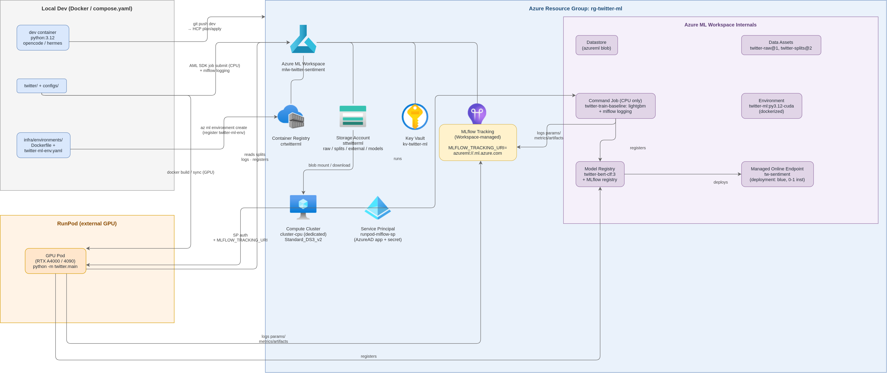

# Sentiment Analysis in Twitter

## Abstract

This project investigates sentiment classification of AI- and machine-learning-related Twitter data. Tweets are assigned one of three sentiment categories (positive, negative, neutral) and are additionally annotated with a continuous valence score in the interval [-1, 1]. Several representation-learning approaches are evaluated on this dataset, including transformer fine-tuning, supervised contrastive learning, SimCSE, and multi-task learning. A Sentence-BERT model trained with a multi-task objective attains an F1-score of 0.79.

## Data

The dataset comprises 8,000 AI- and machine-learning-related tweets, each labeled with a sentiment class and a valence score in [-1, 1], together with metadata fields such as `like_count` and `reply_count`. The class distribution is strongly imbalanced: the majority of instances are neutral, while the negative class accounts for only 6% of the corpus.

<p align="center"></p>

Agreement between the categorical sentiment labels and the continuous valence scores is imperfect; the distributions of valence scores conditional on sentiment class are shown below.

<p align="center"></p>

## Topic Analysis

Topic structure was analyzed following the methodology described in <https://nkoenig06.github.io/gd-tm-cluster.html>, by fitting a Gaussian mixture model to TF-IDF representations of the tweets. Representative samples from the clusters exhibiting the most negative, neutral, and positive sentiment are listed below.

| Sentiment | Examples of Tweets                                                                                                                                                           |
| --------- | ---------------------------------------------------------------------------------------------------------------------------------------------------------------------------- |
| Neutral   | 1. @EpiEllie @ProfMattFox "faithfulness" is assum..., <br> 2. "risk factors", "odd ratios" "correlation" "at..., <br> 3. In examining the causal inference papers publi...   |
| Negative  | 1. Back to School With Antisemites <https://t.co/d>..., <br> 2. Please note, all Jew-haters deny that they are..., <br> 3. @DavidHirsh We have allowed antizionists to co... |
| Positive  | 1. Congratulations @koraykv !!! <https://t.co/keh8>..., <br> 2. RT CRA WP: Join us in celebrating the Skip El..., <br> 3. Congrats to the 76 founders who will be receiv...  |

## Models

The implementation covers the following components:

- fine-tuning and evaluation of several transformer architectures from the `transformers` library on the target dataset;
- supervised contrastive learning (<https://arxiv.org/pdf/2004.11362.pdf>);
- SimCSE (<https://arxiv.org/pdf/2104.08821.pdf>);
- multi-task learning over the sentiment label and the valence score;
- an annotation interface for measuring human performance on the classification task.

The best result to date — an F1-score of 0.79 — was obtained by a Sentence-BERT model fine-tuned with a multi-task objective on both the sentiment label and the valence score.

## Cloud Architecture

CPU training executes as Azure ML jobs with workspace-managed MLflow tracking; transformer fine-tuning runs on RunPod GPU instances.
The complete design is documented in [docs/azure-infrastructure-plan.md](docs/azure-infrastructure-plan.md).

### Logical view

<p align="center"></p>

### Data / training flow

## Usage

### Requirements

The project is distributed as a Python package (see `pyproject.toml`). Installation with the required extras:

```bash
# local dev on CPU (torch extra needs the CPU wheel index)
pip install --extra-index-url https://download.pytorch.org/whl/cpu -e ".[dev,torch,lgbm,llm]"
# GPU training only (torch comes from the RunPod base image)
pip install -e ".[torch]"
# LightGBM baseline only (Azure ML)
pip install -e ".[lgbm]"
# LLM baseline only
pip install -e ".[llm]"
```

### Training

Hyperparameters are specified in the configuration files under the [configs directory](configs). Fine-tuning is initiated by running [main.py](twitter/main.py) with the task and encoder configurations. For example, training a Sentence-BERT model for classification is performed from the repository root as follows:

```bash
python -m twitter.main fit \
    --config configs/tasks/classification.yaml \
    --config configs/encoders/sentence_bert_base.yaml
```

### Evaluation

During training, optimization and validation metrics — together with diagnostic artifacts such as high-confidence errors and confusion matrices — are logged to `tensorboard` and can be inspected via:

```bash
tensorboard --logdir lightning_logs
```

## Annotation Interface

A Gradio-based interface for manual labeling of the dataset, used to benchmark human performance, is launched with:

```bash
gradio twitter/label_game.py
```
