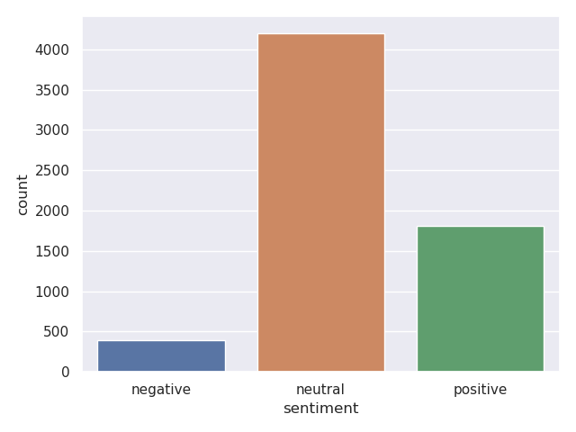
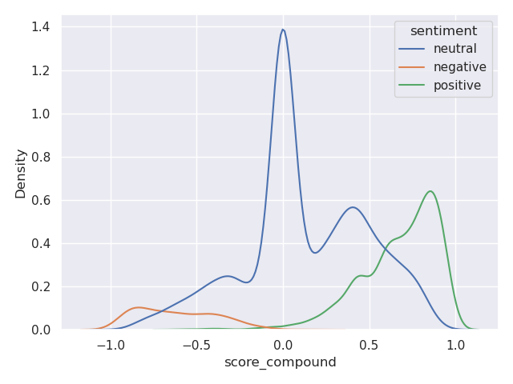

# Sentiment Analysis in Twitter
## Overview

This repo contains the code I wrote for the project from the Machine Learning Core Lecture at Saarland University.
The project is about sentiment analysis on AI- and Machine Learning related Twitter data and
the goal is to classify tweets as positive, negative or neutral.

## Data

### Overview
The dataset for this project was a collection of 8000 AI- and machine
learning- related tweets labeled with a sentiment (positive, negative, neutral)
as well as a valence score between -1 and 1. It additionally contained
meta-data, such as `like_count` or `reply_count`. In general, most of the tweets
were neutral and the negative class was heavily underrepresented, making up
only 6% of the dataset.

<p align="center"></p>

additionally, the valence score did not perfectly align with the sentiment label,
as can be seen in the following plot:

<p align="center"></p>

### Topic Analysis
Inspired by https://nkoenig06.github.io/gd-tm-cluster.html, I ran a
topic analysis using a Gaussian Mixture Model on TF-IDF vectors of the tweets. The table below
shows three tweets from the resulting most negative-, neutral- or positive clusters:

|Sentiment|Examples of Tweets|
|-|-|
|Neutral|1. @EpiEllie @ProfMattFox "faithfulness" is assum..., <br> 2. "risk factors", "odd ratios" "correlation" "at..., <br> 3. In examining the causal inference papers publi...|
|Negative|1. Back to School With Antisemites https://t.co/d..., <br> 2. Please note, all Jew-haters deny that they are..., <br> 3. @DavidHirsh We have allowed antizionists to co...|
|Positive|1. Congratulations @koraykv !!! https://t.co/keh8..., <br> 2. RT CRA WP: Join us in celebrating the Skip El..., <br> 3. Congrats to the 76 founders who will be receiv...|


## Models
The code in this repo allows fine-tuning
transformer-based models from the `transformers` library on the dataset as
well as evaluating their performance. It additionally implements supervised
contrastive learning (https://arxiv.org/pdf/2004.11362.pdf),
SimCSE (https://arxiv.org/pdf/2104.08821.pdf), multi-task learning and
fine-tuning strategies, such as freezing encoder layers.
The models I fine-tuned as well as the hyperparameter settings are listed in
the configuration files inside the [configs directory](configs).

The Sentence-BERT model fine-tuned with a multi-task objective that
incorporated both the sentiment label and the valence score achieved an
F1-score of 0.79 and earned the second place in the course competition.

## Usage

Install the required packages by running the following command:

```bash
pip install -r requirements.txt
```

To fine-tune a model, run the [main.py](twitter/main.py) script with the corresponding configuration
files from the [configs](configs). For example, to train a Sentence-BERT
model for classification run the following command from the root directory of
the repo:

```bash
python -m twitter.main \
    --config configs/tasks/classification.yaml \
    --config configs/encoders/sentence_bert_base.yaml
```

During training, the script will log the training and validation loss, as well as
additional information, such as high-confidence errors to `tensorboard`.
These can be inspected by running the following command:

```bash
tensorboard --logdir lightning_logs
```

## Structure
The code is structured as follows:

- [`twitter/`](twitter/): Contains the main code for the project
    - [`augmentation.py`](twitter/augmentation.py): Implementation of different augmentation strategies
    - [`data.py`](twitter/data.py): Data processing and loading
    - [`main.py`](twitter/main.py): Main script for enabling lightning CLI
    - [`models.py`](twitter/models.py): Building blocks for the different models
    - [`modules.py`](twitter/modules.py): Lightning modules for training and evaluation
    - [`split.py`](twitter/split.py): Code for splitting the dataset into train, validation and test sets
    - [`svm.py`](twitter/svm.py): Code training SVM models to incorporate the meta-data
    - [`unsupervised.py`](twitter/unsupervised.py): Additional analysis that identifies clusters with large positive or negative sentiments
    - [`utils.py`](twitter/.py): Utility functions, such as losses and preprocessing
- [`configs/`](configs/): Contains the configuration files for the different models
    - [`encoders/`](configs/encoders/): Configuration files for the different encoders from the `transformers` library
    - [`tasks/`](configs/tasks/): Configuration files for the different tasks, such as classification, regression, contrastive learning, etc.
    -[`data.yaml`](configs/data.yaml): Configuration files for any data related hyperparameters
    - [`defaults.yaml`](configs/defaults.yaml): Default configuration file, mostly for the lightning trainer
