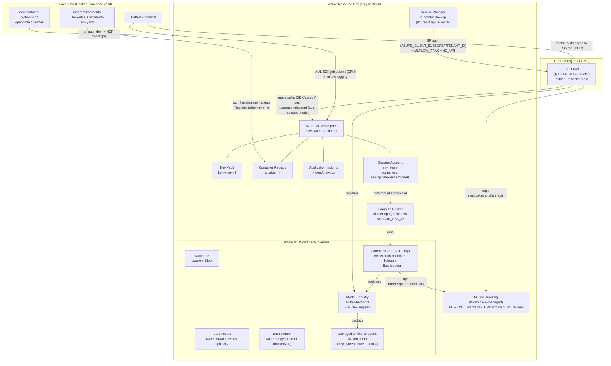
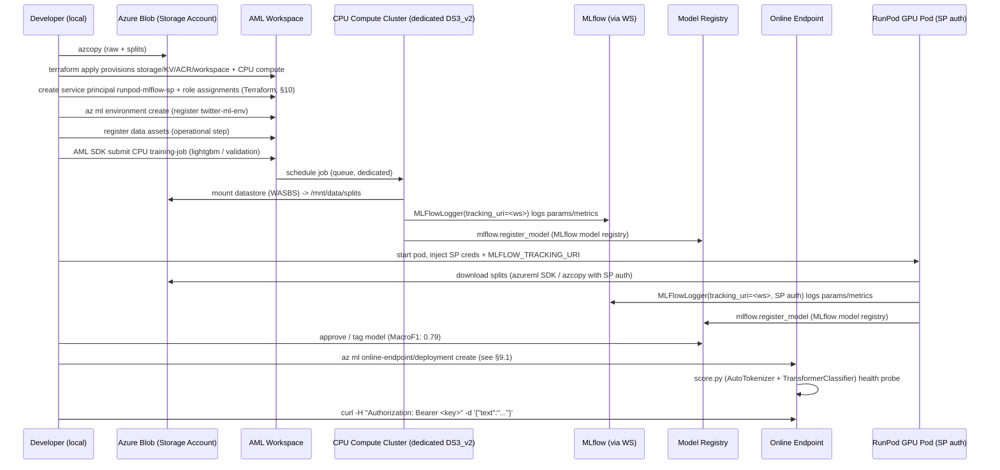

# Azure ML Infrastructure Plan — Twitter Sentiment Project

> **Date:** 2026-09-06
> **Revision:** 2026-09-09 — Phase 1 complete. No quota for low-priority CPU VMs (dedicated only) and no quota for GPU VMs at all. GPU training moves to RunPod (or similar); Azure ML workspace + MLflow tracking are kept and accessed from RunPod via a service principal. CPU VMs use `Standard_DS3_v2` (dedicated).

---

## 1. Overview & Goals

The project is originally a ML competition codebase (Twitter sentiment classification + valence regression, ~8k tweets, heavy class imbalance 6% negative). This plan outlines how to port it to Azure cloud infrastructure. No production intent — goal is learning ML platform technologies.

**Hard requirements:**

| ID | Requirement                   | Success Criteria                                                                                                                                                 |
| -- | ----------------------------- | ---------------------------------------------------------------------------------------------------------------------------------------------------------------- |
| R1 | Store dataset in Azure        | Raw + splits in versioned Azure Storage, registered as Azure ML Data Assets, reproducible `TwitterDataModule(root_dir=...)` without local `data/`                |
| R2 | Train & store models on Azure | CPU jobs (`lightgbm`, data validation) run as AML Command Jobs on Azure ML dedicated CPU compute; GPU jobs (transformer fine-tune) run on RunPod and log/register to the Azure ML workspace + MLflow. Checkpoints valued via `Monitor: MulticlassF1Score / MSE` persisted to cloud    |
| R3 | Use MLflow                    | Every training run logged via MLflow (params, metrics, artifacts, model signature). integrate `lightning.pytorch.loggers.MLFlowLogger`                           |
| R4 | Inference endpoint (explore)  | Deploy one registered model to a Managed Online Endpoint (non-prod, 0/1 instance, key auth) with `score.py` that wraps `AutoTokenizer` + `TransformerClassifier` |

**Constraints:**

- Terraform runs via Terraform HCP (triggered on `git push` to `dev`); no local terraform install needed (see `AGENTS.md`).
- Keep local Docker/Compose DX (`compose.yaml`, `AGENTS.md`). Don’t break `pytest`/`ruff` workflow.
- Budget: learning project → cheapest viable SKUs, auto-shutdown, dedicated (no low-priority quota, no GPU quota on Azure).
- NAT gateways are expensive → avoid them.
- No Azure GPU quota → GPU training runs off-Azure (RunPod or similar); Azure remains system of record for data, MLflow tracking, and model registry.

---

## 2. Target Architecture

### 2.1 mermaid — logical view



### 2.2 mermaid — data / training flow



---

## 3. Azure Resources — Inventory

All resources in **one resource group** for cost visibility + easy teardown (learning project). Region: `West Europe`. Naming: lowercase alphanumeric.

| #  | Terraform Resource Type                     | Name pattern                          | Purpose                                                        | SKU / Notes                                                                                                                                                                       |
| -- | ------------------------------------------- | ------------------------------------- | -------------------------------------------------------------- | --------------------------------------------------------------------------------------------------------------------------------------------------------------------------------- |
| 1  | `azurerm_resource_group`                    | `rg-twitter-ml`                       | Container for all resources                                    | Tags: `project=twitter-sentiment`, `env=dev`, `owner=<you>`                                                                                                                       |
| 2  | `azurerm_storage_account`                   | `sttwitterml`                         | Blob for datasets, checkpoints, external augmentations         | `Standard_LRS`, `kind=StorageV2`, `allow_nested_items_to_be_public=false` (no public blob access), `min_tls_version=TLS1_2`, versioning ON, blob soft-delete 7d                   |
| 3  | `azurerm_storage_container` (×4)            | `raw`, `splits`, `external`, `models` | Logical separation mirroring local `data/*`                    | `container_access_type=private`                                                                                                                                                   |
| 4  | `azurerm_storage_management_policy`         | —                                     | Lifecycle: transition to Cool after 30d, delete temp after 90d | Saves cost for old logs                                                                                                                                                           |
| 5  | `azurerm_log_analytics_workspace`           | `log-twitter-ml`                      | Backend for App Insights                                       | `PerGB2018`, retention 30d (lowest)                                                                                                                                               |
| 6  | `azurerm_application_insights`              | `appi-twitter-ml`                     | Required by AML workspace                                      | `application_type=other`, `workspace_id` → LAW                                                                                                                                    |
| 7  | `azurerm_key_vault`                         | `kv-twitter-ml`                       | Secrets (MLflow keys, Storage keys)                            | `sku_name=standard`, `purge_protection_enabled=false` for dev (true in prod)                                                                                                      |
| 8  | `azurerm_container_registry`                | `crtwitterml`                         | Custom training & inference Docker images                      | `Basic` SKU (≈ $0.17/day), `admin_enabled=true` (the AML workspace association requires the admin account) — store admin credentials in Key Vault                                 |
| 9  | `azurerm_machine_learning_workspace`        | `mlw-twitter-sentiment`               | Core AML                                                       | `kind=default`, `storage_account_id`, `key_vault_id`, `application_insights_id`, `container_registry_id`, `public_network_access_enabled=true` (simpler for learning; VNet later) |
| 10 | `azurerm_machine_learning_compute_cluster`  | `cluster-cpu`                             | CPU-only training (dedicated, no GPU quota, no low-priority quota) | `Standard_DS3_v2`, `vm_priority=Dedicated`, 0→max nodes, idle 300s — see §3.1 |
| 11 | `azurerm_role_assignment` (×N) + `azuread_service_principal` | `runpod-mlflow-sp` + role assignments | Least-privilege incl. RunPod access | Workspace MSI → `Storage Blob Data Contributor` on SA; user → `AzureML Data Scientist` on WS; RunPod SP → `AzureML Data Scientist` on WS + `Storage Blob Data Contributor` on SA (see §10) |
| 12 | *(Future — not Terraform)*                  | `tw-sentiment`                        | Managed Online Endpoint                                        | `auth_mode=key`, `public_network_access_enabled=true` for demo; created via `az ml online-endpoint create` (§9.1)                                                                 |
| 13 | `azurerm_consumption_budget_resource_group` | `budget-twitter-ml`                   | Cost safety net                                                | Alert thresholds at $25 / $50; emails subscription owner                                                                                                                          |
| 14 | *(Future — not Terraform)*                  | `blue`                                | Deployment for registered model                                | `instance_type=Standard_DS3_v2`, `instance_count=1`; created via `az ml online-deployment create` (§9.1)                                                                          |

### 3.1 Compute sizing

> No Azure GPU quota and no low-priority quota → no GPU cluster and no spot in Terraform. Only one dedicated CPU cluster on Azure. All GPU training runs on RunPod (or similar, §7.4).

| Cluster | VM Size | vCPU / RAM / GPU | When to use |
| ------- | ------- | ---------------- | ----------- |
| `cluster-cpu` (Terraform, dedicated) | `Standard_DS3_v2` | 4 / 14GB / — | `lightgbm` TF-IDF baseline, data validation, small CPU smoke tests |
| RunPod pod (external, not Terraform) | e.g. RTX A4000 / 4090 / A5000, 1× GPU | varies / ≥24GB GPU mem preferred | `sentence-bert`, `distilbert`, `twihn` (~110-250M params) fine-tune batch 8-16; larger models on bigger RunPod GPU |

*Rule:* Azure cluster uses `scale_settings { min_node_count=0, max=2, scale_down_nodes_after_idle_duration=PT5M }`. We skip VNet plumbing, so `node_public_ip_enabled` stays at its default `true`. Compute SKU is controlled by `var.compute_vm_size` (default `Standard_DS3_v2`, dedicated) and applied through HCP; note that `vm_size`/`vm_priority` are force-new, so changing either destroys and recreates the cluster. RunPod pods are ephemeral: start → train → push artifacts to Azure → stop; never leave idle.

---

## 4. Terraform Layout & Modules

### 4.1 Directory tree

```text
infra/
├── terraform/
│   ├── README.md                         # how to plan/apply (via Terraform HCP)
│   ├── versions.tf                       # required_version 1.16.0, azurerm ~>5.2.0, random
│   ├── variables.tf                      # env, location, prefix, vm sizes
│   ├── locals.tf                         # naming, tags, suffix
│   ├── main.tf                           # root module wiring
│   ├── outputs.tf                        # workspace id, storage name, tracking uri
│   ├── terraform.tfvars.example
│   ├── environments/
│   │   ├── dev.tfvars                    # location=westeurope, env=dev, dedicated CPU Standard_DS3_v2
│   │   └── prod.tfvars                   # (future) not needed now
│   └── modules/
│       ├── resource_group/
│       │   ├── main.tf
│       │   ├── variables.tf
│       │   └── outputs.tf
│       ├── storage/
│       │   ├── main.tf                   # storage account + containers + lifecycle
│       │   ├── variables.tf
│       │   └── outputs.tf
│       ├── key_vault/
│       ├── container_registry/
│       ├── ml_workspace/
│       │   ├── main.tf                   # azurerm_machine_learning_workspace + depends_on
│       │   ├── variables.tf
│       │   └── outputs.tf
│       ├── ml_compute/
│       │   ├── main.tf                   # cluster + role assignments
│       │   ├── variables.tf
│       │   └── outputs.tf
│       └── monitoring/
│           ├── main.tf                   # log analytics + app insights
│           └── outputs.tf
│   # Inference endpoint/deployment are created via `az ml online-*` (see §9.1) — not Terraform.
```

**Why modules?** Modules make `main.tf` readable. Note: inference (endpoint/deployment) is **not** Terraform-managed (see §9.1), so there is no `enable_inference` toggle in Terraform.

Terraform state and plan/apply are handled by **Terraform HCP**, triggered on `git push` to `dev`; no local bootstrap or remote backend config is needed.

### 4.2 Variables (excerpt)

```hcl
variable "env"              { type = string, default = "dev" }
variable "location"         { type = string, default = "westeurope" }
variable "prefix"           { type = string, default = "twitterml" }
variable "compute_vm_size"  { type = string, default = "Standard_DS3_v2" }
variable "compute_min_nodes"{ type = number, default = 0 }
variable "compute_max_nodes"{ type = number, default = 2 }
variable "vm_priority"      { type = string, default = "Dedicated" } # Dedicated only — no low-priority quota, no GPU quota

# Inference (online endpoint/deployment) is created via `az ml online-*` — see §9.1.
# GPU training runs on RunPod (external, not Terraform) — see §7.4.
```

### 4.3 Root wiring (`main.tf` sketch)

```hcl
module "rg"         { source = "./modules/resource_group" }
module "monitoring" { source = "./modules/monitoring" }
module "storage"    { source = "./modules/storage" }
module "kv"         { source = "./modules/key_vault" }
module "acr"        { source = "./modules/container_registry" }
module "ml_workspace" {
  source   = "./modules/ml_workspace"
  depends_on = [module.storage, module.kv, module.monitoring, module.acr]
}
module "ml_compute" {
  source   = "./modules/ml_compute"
  workspace_id = module.ml_workspace.id
}
# Inference (online endpoint/deployment) is created via `az ml online-*` — see §9.1.
```

---

## 5. Data Storage Strategy

### 5.1 What to store where

| Local Path                                                  | Azure Destination                                                     | Azure ML Abstraction                                                                         | Versioning                              |
| ----------------------------------------------------------- | --------------------------------------------------------------------- | -------------------------------------------------------------------------------------------- | --------------------------------------- |
| `data/raw/tweets_train.csv` (+ test_*)                      | `st…/raw/tweets_train.csv`                                            | `Data Asset` `twitter-raw` (`uri_folder`, `type=uri_folder`, version `1`, `2`…)              | Blob versioning ON + data asset version |
| `data/splits/tweets_{train,dev,test}*.csv` (+ `*_bert.csv`) | `st…/splits/`                                                         | `Data Asset` `twitter-splits` (`uri_folder`) — consumed by `TwitterDataModule(root_dir=...)` | New asset version on each split change  |
| `data/augmentation/{backtranslation,random_insertion}.csv`  | `st…/external/augmentation/`                                          | Part of `twitter-external` asset or separate `twitter-aug`                                   | Append-friendly                         |
| `data/external/` (empty today)                              | `st…/external/`                                                       | Reserved for future SMOTE/TF-IDF artefacts                                                   | —                                       |
| `lightning_logs/`                                           | **not** uploaded — checkpoints go to `st…/models/` or AML job outputs | Job outputs (`outputs/model.ckpt`) auto-uploaded to datastore                                | MLflow artifact store                   |

### 5.2 How `TwitterDataModule` stays compatible

`configs/data.yaml` keeps its local default so `python -m twitter.main` still runs on-device:

- **Local (unchanged default):** `configs/data.yaml` → `root_dir: "data/splits/"`
- **Cloud:** `root_dir` is overridden **at job submission time** (never by editing the committed config), via the job’s CLI argument — not by changing `configs/data.yaml`:

```yaml
# infra/jobs/job-clf-sbert.yaml
inputs:
  splits:
    type: uri_folder
    path: azureml:twitter-splits:1
```

```text
python -m twitter.main \
  --config ... \
  data.init_args.root_dir=${{inputs.splits}}
```

`${{inputs.splits}}` is an Azure ML expression that resolves to the mounted datastore path only inside the AML run; locally it would be an invalid path, so the committed default stays `data/splits/`.

### 5.3 Terraform for storage

```hcl
resource "azurerm_storage_account" "ml" {
  name                     = "st${var.prefix}${random_string.suffix.result}"
  resource_group_name      = module.rg.name
  location                 = module.rg.location
  account_tier             = "Standard"
  account_replication_type = "LRS"
  account_kind             = "StorageV2"
  min_tls_version          = "TLS1_2"
  blob_properties {
    versioning_enabled = true
    delete_retention_policy { days = 7 }
  }
  tags = local.tags
}

resource "azurerm_storage_container" "raw"      { name = "raw";      storage_account_id = azurerm_storage_account.ml.id }
resource "azurerm_storage_container" "splits"   { name = "splits";   storage_account_id = azurerm_storage_account.ml.id }
resource "azurerm_storage_container" "external" { name = "external"; storage_account_id = azurerm_storage_account.ml.id }
resource "azurerm_storage_container" "models"   { name = "models";   storage_account_id = azurerm_storage_account.ml.id }
```

> Note: `azurerm_storage_container` accepts `storage_account_id` across all azurerm versions — use it for forward-compatibility.

### 5.4 Datastore linking

AML workspace auto-creates `workspaceblobstore` pointing at its linked storage. Additional datastores for the 4 containers are created via `azurerm_machine_learning_datastore_blobstorage` in Terraform:

```hcl
# One datastore per container; the resource is azurerm_machine_learning_datastore_blobstorage.
# Auth is via the workspace system-assigned managed identity (no storage keys).
resource "azurerm_machine_learning_datastore_blobstorage" "raw" {
  name                      = "ds_raw"
  workspace_id              = module.ml_workspace.id
  storage_container_id      = azurerm_storage_container.raw.id
  service_data_auth_identity = "WorkspaceSystemAssignedIdentity"
}

resource "azurerm_machine_learning_datastore_blobstorage" "splits" {
  name                       = "ds_splits"
  workspace_id               = module.ml_workspace.id
  storage_container_id       = azurerm_storage_container.splits.id
  service_data_auth_identity = "WorkspaceSystemAssignedIdentity"
}
```

Repeat for `external` and `models` containers.

> Note: with `service_data_auth_identity = "WorkspaceSystemAssignedIdentity"` no `account_key`/`shared_access_signature` is needed, but the workspace MSI requires `Storage Blob Data Contributor` on the storage account (see §10 / §15 IAM). If the identity default (`None`) were kept, either `account_key` or `shared_access_signature` would be required instead.

---

## 6. MLflow Integration

### 6.1 Azure ML’s managed MLflow (zero self-host)

Overview:

- Azure ML managed MLflow (Workspace tracking URI)
- No infra, auto-backed by workspace SA+KV, UI in Azure ML studio, `mlflow` SDK works unchanged

Implementation:

1. **Tracking URI:** `MLFLOW_TRACKING_URI` = `azureml://<region>.api.azureml.ms/mlflow/v1.0/<workspace-id>`, derived from the Terraform output (the provider returns the workspace id; §6.2 builds the URI from it). Use Managed Identity — no PAT.

2. **Lightning logger swap:**

   ```yaml
   # configs/defaults.yaml — before
   trainer:
     logger: null
   # after (dev + cloud)
   trainer:
     logger:
       class_path: lightning.pytorch.loggers.MLFlowLogger
       init_args:
         experiment_name: twitter-sentiment
         tracking_uri: ${MLFLOW_TRACKING_URI}
         tags: {model: sbert, task: clf}
         log_model: true   # stores MLflow pyfunc + checkpoints
   ```

   Add `MLFlowLogger` to all `configs/tasks/*.yaml` or default. Autolog can be added in `twitter/modules.py` (`mlflow.pytorch.autolog()` optional).

3. **Code change (minimal):** In `twitter/modules.py`, allow `self.logger` to be `MLFlowLogger` (already duck-typed). Remove TensorBoard-only branches — keep `add_text/figure` but gate on logger type (MLflow logs via `logger.experiment.log_text` or `mlflow.log_figure`). Simpler: log confusion matrix as `mlflow.log_figure(fig, "confusion_matrix.png")`.

4. **Auth:**
   - Locally `az login` then `mlflow` uses `DefaultAzureCredential`. In AML CPU job, `MLFLOW_TRACKING_URI` + managed identity auto-auth (no secret).
   - On RunPod (external GPU), auth uses the `runpod-mlflow-sp` service principal (§10): `AZURE_CLIENT_ID`, `AZURE_CLIENT_SECRET`, `AZURE_TENANT_ID` + `MLFLOW_TRACKING_URI`. `DefaultAzureCredential` (env-var path) picks it up automatically, so `mlflow` SDK and `azure-ai-ml` SDK need no code change. Secret lives in Key Vault; injected into the pod as env vars and never committed.

5. **Artifacts:** Checkpoints (`ModelCheckpoint` callback) + `lightning_logs/` → MLflow artifact store (backed by `st…/azureml` container). Register model via `mlflow.register_model()`.

### 6.2 Terraform output needed

```hcl
# The provider does not export an MLflow tracking URI, so build it from region + workspace id:
# azureml://<region>.api.azureml.ms/mlflow/v1.0/<workspace_id>
output "mlflow_tracking_uri" {
  value = format(
    "azureml://%s.api.azureml.ms/mlflow/v1.0/%s",
    var.location, azurerm_machine_learning_workspace.this.id
  )
}
output "workspace_name"   { value = azurerm_machine_learning_workspace.this.name }
output "workspace_id"     { value = azurerm_machine_learning_workspace.this.id }
```

### 6.3 Local vs cloud parity

- **Local dev:** `MLFLOW_TRACKING_URI` can point to `http://localhost:5000` (run `mlflow server --backend-store-uri sqlite:///mlflow.db --default-artifact-root ./mlruns`) or directly to Azure (`az login` required). Document both in `.env.example`.
- **CI:** Not required initially; mention for completeness.

---

## 7. Training Pipeline (Azure ML Jobs + RunPod GPU)

No need for Kubeflow/Airflow. Azure ML **Command Jobs** cover CPU work; GPU transformer fine-tuning runs on **RunPod** and logs to the same Azure-managed MLflow.

### 7.1 Environment

```dockerfile
# infra/environments/Dockerfile (extends base)
FROM mcr.microsoft.com/azureml/openmpi4.1.0-cuda11.8-cudnn8-ubuntu22.04
COPY requirements-shared.txt .
COPY requirements-cloud.txt .
RUN pip install --no-cache-dir -r requirements-shared.txt \
    && pip install --no-cache-dir -r requirements-cloud.txt
# Hugging Face cache env
ENV HF_HOME=/tmp/hf_cache
```

Register the environment via the AML CLI (an operational step, not Terraform). The YAML lives in `infra/environments/twitter-ml-env.yaml` and is registered with:

```bash
az ml environment create --file infra/environments/twitter-ml-env.yaml --workspace-name "$(tf output workspace_name)"
```

The job then references it as `environment: azureml:twitter-ml-env:1`, versioned by the asset store.

### 7.2 Job YAML (example: classification)

```yaml
# infra/jobs/job-clf-sbert.yaml  (CPU example; GPU variant runs on RunPod, see §7.4)
$schema: https://azuremlschemas.azureedge.net/latest/commandJob.schema.json
command: >-
  python -m twitter.main
    --config configs/tasks/classification.yaml
    --config configs/encoders/sentence_bert_base.yaml
    data.init_args.root_dir=${{inputs.splits}}
    trainer.logger.class_path=lightning.pytorch.loggers.MLFlowLogger
    trainer.logger.init_args.experiment_name=twitter-clf
    trainer.logger.init_args.tracking_uri=${{env.MLFLOW_TRACKING_URI}}
    trainer.max_epochs=10
code: .  # uploaded from local
inputs:
  splits:
    type: uri_folder
    path: azureml:twitter-splits:1
environment: azureml:twitter-ml-env:1
compute: azureml:cluster-cpu
experiment_name: twitter-sentiment
display_name: sbert-clf-run-${{BUILD_ID}}
outputs:
  model_dir:
    type: uri_folder
    path: azureml://datastores/workspaceblobstore/paths/models/sbert-clf/${{name}}/
services:
  # optional: enable TensorBoard via AML
```

Submit the job via the AML SDK (operational step, not Terraform):

```python
# Or via Azure ML Python SDK v2 (CPU jobs)
from azure.ai.ml import MLClient, command

ml_client = MLClient.from_config()
job = ml_client.jobs.create_or_update(
    command(
        code=".",
        command="python -m twitter.main --config ...",
        environment="azureml:twitter-ml-env:1",
        compute="azureml:cluster-cpu",
        experiment_name="twitter-sentiment",
    )
)
ml_client.jobs.stream(job.name)
```

### 7.3 Mapping existing configs

| Task                | Config pair                                       | Where                  | Metrics                                           |
| ------------------- | ------------------------------------------------- | ---------------------- | ------------------------------------------------- |
| `clf`               | `classification.yaml` + `sentence_bert_base.yaml` | RunPod GPU (§7.4)      | `MulticlassF1Score` (macro), `MulticlassAccuracy` |
| `reg`               | `regression.yaml` + `sentence_bert_base.yaml`     | RunPod GPU (§7.4)      | `MeanSquaredError` (RMSE)                         |
| `multitask`         | `multitask.yaml` + `sentence_bert_base.yaml`      | RunPod GPU (§7.4)      | both — `loss_weight` logged to MLflow             |
| `lightgbm` baseline | `twitter/baselines/lightgbm_baseline.py` + TF-IDF | `cluster-cpu` (Azure)  | Macro F1 / RMSE                                   |
| `llm` baseline      | `llm_baseline.py` (calls Foundry)                 | `cluster-cpu` or local | No training — skip AML                            |

### 7.4 GPU training on RunPod (external, SP-authenticated)

Azure has no GPU quota, so all transformer fine-tuning runs on a RunPod GPU pod but remains fully tracked in the Azure ML workspace / MLflow.

1. **Prereqs (Terraform, §10):** `runpod-mlflow-sp` service principal exists with `AzureML Data Scientist` on the workspace + `Storage Blob Data Contributor` on the storage account. Secret stored in Key Vault.
2. **Start pod:** GPU pod (e.g. RTX A4000/4090) with PyTorch CUDA image; sync repo (`git clone` / `runpod` volume) and `pip install -r requirements-shared.txt -r requirements-cloud.txt`.
3. **Inject creds (env vars, never committed):**
   ```bash
   export AZURE_CLIENT_ID="<sp-client-id>"
   export AZURE_CLIENT_SECRET="<from-key-vault>"
   export AZURE_TENANT_ID="<tenant-id>"
   export AZURE_SUBSCRIPTION_ID="<sub-id>"
   export MLFLOW_TRACKING_URI="azureml://westeurope.api.azureml.ms/mlflow/v1.0/<workspace-id>"  # = terraform output mlflow_tracking_uri
   ```
   `DefaultAzureCredential` picks up the SP automatically — no code change in `twitter/` or MLflow setup.
4. **Fetch data:** download `twitter-splits` via the AML SDK / `azcopy` authenticated as the SP (same `Storage Blob Data Contributor` role), or `mlflow` artifact download. Keep the same `data.init_args.root_dir=<local pod path>` override pattern as §5.2.
5. **Run training — identical command, identical MLflow logger:**
   ```bash
   python -m twitter.main \
     --config configs/tasks/classification.yaml \
     --config configs/encoders/sentence_bert_base.yaml \
     data.init_args.root_dir=./data/splits \
     trainer.logger.class_path=lightning.pytorch.loggers.MLFlowLogger \
     trainer.logger.init_args.experiment_name=twitter-clf \
     trainer.logger.init_args.tracking_uri=${MLFLOW_TRACKING_URI} \
     trainer.max_epochs=10
   ```
   Params/metrics/artifacts land in the Azure-managed MLflow; register with `mlflow.register_model("runs:/<run_id>/model", "twitter-bert-clf")` as usual.
6. **Stop pod** immediately after the run uploads artifacts — RunPod bills per second while running.

---

## 8. Model Registry & Artifacts

Use the **workspace-backed MLflow Model Registry** for model versioning, registering via `mlflow.register_model("runs:/<run_id>/model", "twitter-bert-clf")`; the AML endpoint can deploy that registered MLflow model directly.

Artifacts to log per run:

- `configs/*.yaml` (as `mlflow.log_artifact`)
- Checkpoint `*.ckpt` (via `ModelCheckpoint` + `MLFlowLogger(log_model=True)` → `MLmodel` + `python_env.yaml`)
- Tokenizer (`AutoTokenizer.save_pretrained` → artifact)
- Metrics CSV + confusion matrix PNG + `lightning_logs/` summary
- `requirements.txt` hash for reproducibility

Naming: `twitter-{encoder}-{task}:{version}` e.g., `twitter-sbert-clf:2`, tags `macro_f1=0.79`, `rmse=0.21`, `encoder=sentence-transformers/all-MiniLM-L6-v2`.

---

## 9. Inference Endpoint (Non-Production)

**Goal:** *Try it out* — not SLA, scale-to-zero allowed.

### 9.1 Resource plan

Managed online endpoints are created with the AML CLI/SDK — an operational step, since the provider ships no endpoint resources:

```bash
# infra/endpoints/endpoint.yaml + infra/endpoints/deployment-blue.yaml
az ml online-endpoint create --file infra/endpoints/endpoint.yaml
az ml online-deployment create --file infra/endpoints/deployment-blue.yaml
az ml online-endpoint update --name tw-sentiment --traffic "blue=100"
```

`infra/endpoints/*.yaml` reference the Terraform-managed resources via outputs (workspace name from `terraform output workspace_name`; model from the MLflow registry `azureml:twitter-sbert-clf:2`).

So compute is IaC while the endpoint/deployment is managed with `az ml` — wrap the three commands above in a `infra/endpoints/deploy.sh` script for a one-step bring-up/tear-down of the demo endpoint.

### 9.2 Scoring script (`score.py`)

```python
# infra/endpoints/scoring/score.py
import json, torch
from transformers import AutoTokenizer, AutoModel
from twitter.models import TransformerClassifier

def init():
    global model, tokenizer
    model = TransformerClassifier.load_from_checkpoint(...)  # or mlflow.pyfunc.load_model
    tokenizer = AutoTokenizer.from_pretrained("sentence-transformers/all-MiniLM-L6-v2")
    model.eval()

def run(raw_data):
    data = json.loads(raw_data)
    inputs = tokenizer(data["text"], return_tensors="pt", truncation=True, padding=True)
    with torch.no_grad():
        logits = model(inputs["input_ids"], inputs["attention_mask"])
        pred = logits.argmax(-1).item()
    return {"prediction": int(pred), "label": ["negative","neutral","positive"][pred]}
```

Include `requirements.txt` pinning `mlflow`, `transformers`, `torch`, `lightning`.

### 9.3 Non-prod guardrails

- Scale to 0/1 via the deployment YAML (endpoints are managed with `az ml`, see §9.1).
- Key auth only for demo; rotate via `az ml online-endpoint get-credentials` (see §9.1).
- Monitor cost: endpoint idle ≈ $0.09/h for DS3_v2-class; tear down via `az ml online-endpoint delete --name tw-sentiment` after demo.
- Document `curl` + `mlflow deployments predict` both.

---

## 10. IAM, Security & Networking

| Area          | Dev Plan                                                                                                                                                                                              |
| ------------- | ----------------------------------------------------------------------------------------------------------------------------------------------------------------------------------------------------- |
| **Auth**      | `az login` (user), managed identity for Azure CPU compute/endpoint; service principal `runpod-mlflow-sp` for RunPod GPU runs (`AZURE_CLIENT_ID/SECRET/TENANT_ID` + `MLFLOW_TRACKING_URI`)             |
| **RBAC**      | User = `Contributor` on RG + `AzureML Data Scientist` on WS; Workspace MSI = `Storage Blob Data Contributor` on SA, `AcrPull` on ACR; RunPod SP = `AzureML Data Scientist` on WS + `Storage Blob Data Contributor` on SA (least privilege for external training) |
| **Key Vault** | Soft-delete 7d, purge protection OFF (easy cleanup); stores RunPod SP secret                                                                                                                          |
| **Network**   | `public_network_access_enabled=true` for learning (lets RunPod reach workspace + MLflow without VNet/Private Link)                                                                                    |
| **Secrets**   | `MLFLOW_TRACKING_URI` output, SA keys not used (identity); SP secret never committed, injected as env var                                                                                             |
| **Data**      | `.gitignore` keeps `data/` local; blob private                                                                                                                                                        |

**All IAM, role assignments, service principals, and access policies are managed via Terraform** — no ad-hoc `az role assignment create` or `az keyvault set-policy` commands. Role assignments live in the same module as the resource they grant access to (e.g., `modules/ml_compute/main.tf` for workspace MSI roles, `modules/storage/main.tf` for SA roles; RunPod SP + its assignments in a new `modules/runpod_sp/` module). The signed-in user's Contributor role on the RG is assumed pre-existing (created via Azure portal during subscription setup) and not part of the Terraform state.

### RunPod SP details (Terraform-managed)

- `azuread_application` + `azuread_service_principal` + `azuread_service_principal_password` (or federated credential later) named `runpod-mlflow-sp`.
- Role assignments: SP → `AzureML Data Scientist` on workspace scope (log experiments, register models); SP → `Storage Blob Data Contributor` on storage account scope (read `splits`, write `models` artifacts via MLflow artifact store).
- SP client ID / tenant ID as Terraform outputs; secret written to Key Vault (`kv-twitter-ml`, secret `runpod-mlflow-sp-secret`), read at pod start with `az keyvault secret show` (as the developer) and exported as `AZURE_CLIENT_SECRET`.
- Rotation: regenerate `azuread_service_principal_password` via HCP apply; no code change needed.

---

## 11. Cost Control

This is a learning project — every resource is chosen to be as cheap as possible while still useful. The main cost driver is compute time; everything else is negligible in comparison.

### Compute

- Azure CPU cluster scales to **zero nodes** (`min_node_count=0`, `scale_down_nodes_after_idle_duration=PT5M`). You pay nothing when idle.
- **Dedicated `Standard_DS3_v2`** for the Azure CPU cluster — no low-priority quota, so no spot discount. Keep `max_node_count=2` and scale-to-zero to bound cost.
- **RunPod (separate bill, not Azure):** GPU pods are ephemeral — start, train, stop. Prefer cheap 1×-GPU pods (e.g. RTX A4000/4090); stop immediately after artifacts upload. Set a RunPod spending limit if available.

### Storage & Services

- `Standard_LRS` — replication overhead is unnecessary for a learning project.
- Log Analytics daily cap at 1 GB and retention at 30 days.
- Container soft-delete 7 days on blob storage — enough to recover accidental deletes without paying for long retention.

### Inference endpoint

- Managed online endpoints are created with `az ml online-endpoint/deployment create` (see §9.1); don't leave the endpoint running — an idle DS3_v2-class endpoint adds meaningful cost for no benefit. (`Standard_DS2_v2` in older examples is replaced by `Standard_DS3_v2` to match available CPU quota.)

### Safety net

- A `Budget Alert` at $25 / $50 via `azurerm_consumption_budget_resource_group` is created using Terraform

---

## 12. CI/CD Workflow

**CI (Terraform HCP):**

- Push to `dev` triggers Terraform HCP to run `terraform plan`; a human approves and applies (already implemented).
- AML operational commands (`az ml job`, `az ml data`) run from the Docker dev container (same image as `Dockerfile`).

No change to `compose.yaml` needed; add `.env` for `MLFLOW_TRACKING_URI`, `AZURE_SUBSCRIPTION_ID`.

---

## 13. Implementation Roadmap (Phases)

### Phase 1 — Terraform scaffolding (this plan → code)

- [ ] Create `infra/terraform/{versions,variables,main,outputs}.tf` + `modules/*` per §5
- [ ] Add `azurerm_consumption_budget_resource_group` ($25 / $50 alert thresholds)
- [ ] Add `terraform.tfvars.example`, `environments/dev.tfvars`
- [ ] `git push origin-http dev` to trigger `terraform plan` (human will verify and apply the plan)

**Success:** Human reports no errors and approves moving to phase 2.

### Phase 2 — Data on Azure

- [ ] `azcopy` to upload `data/splits` to Terraform-managed containers (service principal with permissions is available in agent vault, so should just work)
- [ ] Register `twitter-splits:1` as AML Data Asset (operational step)
- [ ] Validate `TwitterDataModule(root_dir=<azureml mounted>)` locally

**Success:** Dataset is uploaded and `TwitterDataModule(root_dir=<azureml mounted>)` validation passes

### Phase 3 — MLflow + Training (CPU on AML, GPU on RunPod)

- [ ] Add `MLFlowLogger` to `configs/defaults.yaml` (or task configs) + conditional `MLFLOW_TRACKING_URI`
- [ ] Update `twitter/modules.py` to support MLflow figure logging fallback
- [ ] Create `infra/environments/twitter-ml-env.yaml` + `Dockerfile` (don't override current dev environment Dockerfile, create a new one)
- [ ] `terraform apply` provisions dedicated CPU cluster (`Standard_DS3_v2`); register AML environment (operational step)
- [ ] Terraform provisions `runpod-mlflow-sp` + roles (see §10); store secret in Key Vault
- [ ] Submit `lightgbm`/validation job on `cluster-cpu`, check MLflow UI (`azureml://...`)
- [ ] Run `clf`/`reg`/`multitask` GPU fine-tunes on RunPod per §7.4 (SP env vars + `MLFLOW_TRACKING_URI`), verify same MLflow experiment shows runs and registered models

**Success:** MLflow shows CPU runs plus RunPod GPU runs with `MulticlassF1Score` and `MeanSquaredError`, and models registered as `twitter-*-*:*`.

---

## 14. Risks & Open Decisions

| Risk / Decision                                                                                          | Impact | Mitigation / Recommendation                                                                          |
| -------------------------------------------------------------------------------------------------------- | ------ | ---------------------------------------------------------------------------------------------------- |
| **No Azure GPU / low-priority quota** — GPU must run on RunPod                                            | Medium | RunPod pods log to Azure MLflow via `runpod-mlflow-sp` (§7.4, §10); keep runs short, stop pods; Azure stays system of record |
| **RunPod SP secret leak**                                                                                 | High   | Least-privilege roles only (Data Scientist + Blob Contributor), secret in Key Vault, env-var injection, rotate via HCP |
| **MLflow version skew** — AML supports `mlflow 2.9–2.13` (check). Local `mlflow` latest may mismatch     | Low    | Pin `mlflow==2.12.0` in `requirements.txt` after checking the supported range in the AML docs/Azure portal — pin the same version on RunPod |
| **T4 spot preemption** during 10-epoch S-BERT fine-tune (≈ 15 min) — N/A (no spot; RunPod is on-demand per-second) | Low | `ModelCheckpoint` every epoch; RunPod pods are on-demand so no eviction, but still checkpoint in case the pod is stopped |
| **Data size 8k tweets ~ <10MB** but `tiktoken` + `openai` LLM baseline uses Foundry (not AML)            | Low    | Keep LLM baseline local; only `clf/reg` on RunPod GPU. Mention in docs.                                     |
| **Endpoint cost surprise**                                                                               | High   | Endpoint created via `az ml` only while demoing; delete right after; set budget alert |
| **HF cache / rate limits** inside AML job                                                                | Medium | Set `HF_HOME=/tmp`, `TRANSFORMERS_OFFLINE=0`, cache to blob if needed                                |

---

## 15. Terraform Snippets (Illustrative)

*All snippets are plan-level — not to be applied without review. Syntax validated against `hashicorp/azurerm >=3.100`.*

### `infra/terraform/modules/ml_workspace/main.tf`

```hcl
variable "name"              { type = string }
variable "resource_group_name" { type = string }
variable "location"          { type = string }
variable "storage_account_id" { type = string }
variable "key_vault_id"      { type = string }
variable "application_insights_id" { type = string }
variable "container_registry_id" { type = string }
variable "tags"              { type = map(string) }

resource "azurerm_machine_learning_workspace" "this" {
  name                    = var.name
  location                = var.location
  resource_group_name     = var.resource_group_name
  application_insights_id = var.application_insights_id
  key_vault_id            = var.key_vault_id
  storage_account_id      = var.storage_account_id
  container_registry_id   = var.container_registry_id

  identity { type = "SystemAssigned" }
  public_network_access_enabled = true
  tags = var.tags
}
```

### `infra/terraform/modules/ml_compute/main.tf` (CPU-only, dedicated)

```hcl
variable "workspace_id" { type = string }
variable "location"     { type = string }
variable "vm_size"      { type = string, default = "Standard_DS3_v2" }
variable "vm_priority"  { type = string, default = "Dedicated" } # no low-priority quota
variable "min_nodes"    { type = number, default = 0 }
variable "max_nodes"    { type = number, default = 2 }

resource "azurerm_machine_learning_compute_cluster" "cpu" {
  name                          = "cluster-cpu"
  location                      = var.location
  vm_priority                   = var.vm_priority
  vm_size                       = var.vm_size
  machine_learning_workspace_id = var.workspace_id

  scale_settings {
    min_node_count                       = var.min_nodes
    max_node_count                       = var.max_nodes
    scale_down_nodes_after_idle_duration = "PT5M"
  }
  tags = { purpose = "training-cpu" }
}
# No GPU cluster — GPU training runs on RunPod (§7.4).
```

### `infra/terraform/modules/runpod_sp/main.tf` (new — RunPod service principal)

```hcl
# AzureAD app + SP that RunPod pods use to reach the workspace + MLflow.
resource "azuread_application" "runpod" { display_name = "runpod-mlflow-sp" }
resource "azuread_service_principal" "runpod" { client_id = azuread_application.runpod.client_id }
resource "azuread_service_principal_password" "runpod" { service_principal_id = azuread_service_principal.runpod.id }

# SP → AzureML Data Scientist on workspace (log to MLflow, register models)
resource "azurerm_role_assignment" "runpod_sp_ml_ds" {
  scope                = var.workspace_id
  role_definition_name = "AzureML Data Scientist"
  principal_id         = azuread_service_principal.runpod.object_id
}

# SP → Storage Blob Data Contributor (read splits, write model artifacts)
resource "azurerm_role_assignment" "runpod_sp_storage" {
  scope                = var.storage_account_id
  role_definition_name = "Storage Blob Data Contributor"
  principal_id         = azuread_service_principal.runpod.object_id
}

# SP secret → Key Vault (pod injects it as AZURE_CLIENT_SECRET)
resource "azurerm_key_vault_secret" "runpod_sp" {
  name         = "runpod-mlflow-sp-secret"
  value        = azuread_service_principal_password.runpod.value
  key_vault_id = var.key_vault_id
}
```

### `infra/terraform/outputs.tf`

```hcl
output "resource_group_name"   { value = module.rg.name }
output "storage_account_name"  { value = module.storage.account_name }
output "workspace_name"        { value = module.ml_workspace.name }
# Constructed by the ml_workspace module (see §6.2)
output "mlflow_tracking_uri"   { value = module.ml_workspace.mlflow_tracking_uri }
output "acr_login_server"      { value = module.acr.login_server }
```

### IAM role assignments — `modules/ml_compute/main.tf` (excerpt)

All role assignments are Terraform-managed. The workspace MSI gets its roles in the same module that creates the compute, so `depends_on` ordering is implicit.

```hcl
data "azurerm_client_config" "current" {}

# Workspace system-assigned managed identity
data "azurerm_machine_learning_workspace" "this" {
  name                = var.workspace_name
  resource_group_name = var.resource_group_name
}

# Workspace MSI → Storage Blob Data Contributor (needed to read/write datasets + model artifacts)
resource "azurerm_role_assignment" "ws_msi_storage" {
  scope                = var.storage_account_id
  role_definition_name = "Storage Blob Data Contributor"
  principal_id         = data.azurerm_machine_learning_workspace.this.identity[0].principal_id
}

# Workspace MSI → AcrPull (pull training/inference images)
resource "azurerm_role_assignment" "ws_msi_acr" {
  scope                = var.container_registry_id
  role_definition_name = "AcrPull"
  principal_id         = data.azurerm_machine_learning_workspace.this.identity[0].principal_id
}

# Signed-in user → AzureML Data Scientist on workspace (required for az ml jobs)
resource "azurerm_role_assignment" "user_ml_ds" {
  scope                = var.workspace_id
  role_definition_name = "AzureML Data Scientist"
  principal_id         = data.azurerm_client_config.current.object_id
}
```

---

## 16. Appendices

### A. Glossary

| Term                        | Meaning                                                                                                  |
| --------------------------- | -------------------------------------------------------------------------------------------------------- |
| **AML**                     | Azure Machine Learning (service). Workspace is the top-level object binding storage/KV/ACR/App Insights. |
| **Data Asset**              | AML-registered dataset (`azureml:twitter-splits:1`), versioned, backs lineage                            |
| **Datastore**               | AML pointer to a Storage Account container (WASBS)                                                       |
| **Command Job**             | Batch training job with `command:` + `code:` + `inputs:` + `compute:` (provisioned via Terraform)          |
| **MLflow Tracking URI**     | URI like `azureml://...` or `https://<ws>.ml.azure.com` that `mlflow` SDK uses to log                    |
| **Managed Online Endpoint** | AML-hosted HTTPS endpoint (Kubernetes-free) with auth key, auto-scaling                                  |

### B. Explicit non-goals (this plan does NOT do)

- No production hardening (VNet, Private Link, multi-env prod, SLA endpoint).
- No migration of `lightning_logs/` history — new runs go to MLflow/AML.
- No change to `gradio` label game or `topic analysis` — out of scope.
