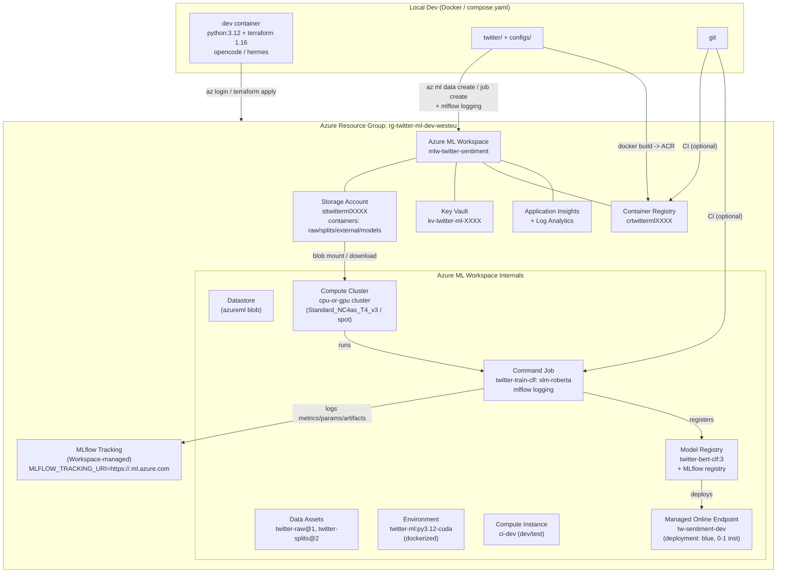
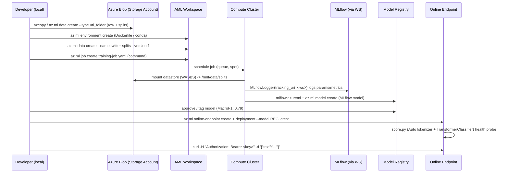

# Azure ML Infrastructure Plan — Twitter Sentiment Project

> **Date:** 2026-09-01
> **Status:** Planning only — no Azure resources have been created
> **Scope:** `docs/improvement-plan.md` → Infrastructure: *Store dataset in Azure · Train and store models on Azure · Use mlflow · Try inference endpoint (non-production)*
> **Author:** Automated plan generation from local repo inspection (`compose.yaml`, `Dockerfile`, `AGENTS.md`, `requirements.txt`, `twitter/`, `configs/`, `data/`)

---

## Table of Contents

1. [Overview & Goals](#1-overview--goals)
2. [Current Local Infrastructure](#2-current-local-infrastructure)
3. [Target Architecture](#3-target-architecture)
4. [Azure Resources — Inventory](#4-azure-resources--inventory)
5. [Terraform Layout & Modules](#5-terraform-layout--modules)
6. [Data Storage Strategy](#6-data-storage-strategy)
7. [MLflow Integration](#7-mlflow-integration)
8. [Training Pipeline (Azure ML Jobs)](#8-training-pipeline-azure-ml-jobs)
9. [Model Registry & Artifacts](#9-model-registry--artifacts)
10. [Inference Endpoint (Non-Production)](#10-inference-endpoint-non-production)
11. [IAM, Security & Networking](#11-iam-security--networking)
12. [Cost Control](#12-cost-control)
13. [CI/CD & Local Dev Workflow](#13-cicd--local-dev-workflow)
14. [Implementation Roadmap (Phases)](#14-implementation-roadmap-phases)
15. [Risks & Open Decisions](#15-risks--open-decisions)
16. [Terraform Snippets (Illustrative)](#16-terraform-snippets-illustrative)
17. [Appendices](#17-appendices)

---

## 1. Overview & Goals

**Context from `docs/improvement-plan.md:46-53`:** The project is a Saarland University ML competition codebase (Twitter sentiment classification + valence regression, ~8k tweets, heavy class imbalance 6% negative). No production intent — goal is learning ML platform technologies.

**Hard requirements:**

| ID | Requirement                   | Success Criteria                                                                                                                                                                     |
| -- | ----------------------------- | ------------------------------------------------------------------------------------------------------------------------------------------------------------------------------------ |
| R1 | Store dataset in Azure        | Raw + splits in versioned Azure Storage, registered as Azure ML Data Assets, reproducible `TwitterDataModule(root_dir=...)` without local `data/`                                    |
| R2 | Train & store models on Azure | `python -m twitter.main` equivalent runs as `az ml job` on Azure ML compute, checkpoints valued via `Monitor: MulticlassF1Score / MSE` persisted to cloud                            |
| R3 | Use MLflow                    | Every training run logged via MLflow (params, metrics, artifacts, model signature). `requirements.txt:26` already lists `mlflow`; integrate `lightning.pytorch.loggers.MLFlowLogger` |
| R4 | Inference endpoint (explore)  | Deploy one registered model to a Managed Online Endpoint (non-prod, 0/1 instance, key auth) with `score.py` that wraps `AutoTokenizer` + `TransformerClassifier`                     |

**Constraints:**

- Plan only — no `az`/`terraform apply` side-effects now.
- Terraform 1.16.0 already in `Dockerfile:21-23` (`FROM python:3.12-slim` + `hashicorp/terraform/1.16.0`). Reuse it.
- Keep local Docker/Compose DX (`compose.yaml:1-11`, `AGENTS.md:1`). Don’t break `pytest`/`ruff` workflow.
- Budget: learning project → cheapest viable SKUs, auto-shutdown, spot.
- VRAM limit from later plan step: `≤24GB VRAM` per model → compute choice must respect it.
- NAT gateways are expensive → avoid them.

---

## 2. Current Local Infrastructure

| Area            | Current State                                                                                                                                                                                 | File                                                                      |
| --------------- | --------------------------------------------------------------------------------------------------------------------------------------------------------------------------------------------- | ------------------------------------------------------------------------- |
| **Runtime**     | `python:3.12-slim`, `pip install -r requirements.txt`, user `agent:1000`, `opencode` + `hermes` baked in                                                                                      | `Dockerfile:1-36`                                                         |
| **Dev loop**    | `compose.yaml` builds `dev` service, bind-mounts `.:/workspace`, persists `~/.hermes`, `~/.config/opencode`                                                                                   | `compose.yaml:1-11`                                                       |
| **Python deps** | `torch` (CPU wheel), `lightning`, `transformers`, `tiktoken`, `openai`, `mlflow` (present but unused), `lightgbm`, `tensorboard`                                                              | `requirements.txt:1-29`                                                   |
| **Data**        | `data/raw/tweets_train.csv`, `data/splits/tweets_{train,dev,test_*}*.csv`, `data/augmentation/`, `data/external/` — all **gitignored**                                                        | `.gitignore:2`, `data/` listing                                           |
| **Config**      | `LightningCLI` with `configs/defaults.yaml` (trainer=null logger) + `configs/data.yaml` (`root_dir: data/splits/`) + `configs/tasks/{clf,reg,multitask,scl}.yaml` + `configs/encoders/*.yaml` | `twitter/main.py:3-16`, `configs/`                                        |
| **Data code**   | `TwitterDataModule(root_dir, features, labels, encoder_name, batch_size, ...)` loads `tweets_{split}.csv`; supports `ExternalTextDataset`                                                     | `twitter/data.py:223-417`                                                 |
| **Model code**  | `TransformerEncoder` (HF `AutoModel`), `TransformerRegressor/Classifier`, `MultiTaskModule`, `SupervisedContrastive*`; metrics via `torchmetrics`                                             | `twitter/models.py`, `twitter/modules.py:20-441`                          |
| **Logging**     | `trainer.logger: null` in `defaults.yaml:9`; manual `TensorBoard` via `self.logger.experiment.add_text/figure`                                                                                | `configs/defaults.yaml:9`, `twitter/modules.py:79-118`, `README.md:74-79` |
| **Terraform**   | **None** on disk (`glob **/*.tf` = 0). Binary present in image. No state backend yet.                                                                                                         | `glob` result                                                             |
| **MLflow**      | Listed as dep, **zero imports** in `twitter/` (`grep mlflow` → 2 hits only in docs). Opportunity for swap.                                                                                    | `grep`                                                                    |

**Implication:** The migration is mostly *configuration* — add logger, upload data, wrap training as AML job. No model code rewrite required except making `root_dir` + logger injectable.

---

## 3. Target Architecture

### 3.1 mermaid — logical view



### 3.2 mermaid — data / training flow



---

## 4. Azure Resources — Inventory

All resources in **one resource group** for cost visibility + easy teardown (learning project). Region: `West Europe` (or `Sweden Central` for lower latency if organizer prefers; pick one and pin via variable). Naming: lowercase alphanumeric, globally unique suffix `${random_id}`.

| #  | Terraform Resource Type                                                        | Name pattern                             | Purpose                                                        | SKU / Notes                                                                                                                                                                       |
| -- | ------------------------------------------------------------------------------ | ---------------------------------------- | -------------------------------------------------------------- | --------------------------------------------------------------------------------------------------------------------------------------------------------------------------------- |
| 1  | `azurerm_resource_group`                                                       | `rg-twitter-ml-${env}-${location_short}` | Container for all resources                                    | Tags: `project=twitter-sentiment`, `env=dev`, `owner=<you>`                                                                                                                       |
| 2  | `azurerm_storage_account`                                                      | `sttwitterml${random}${env}`             | Blob for datasets, checkpoints, external augmentations         | `Standard_LRS`, `kind=StorageV2`, `allow_blob_public_access=false`, `min_tls_version=TLS1_2`, versioning ON, container soft-delete 7d                                             |
| 3  | `azurerm_storage_container` (×4)                                               | `raw`, `splits`, `external`, `models`    | Logical separation mirroring local `data/*`                    | `container_access_type=private`                                                                                                                                                   |
| 4  | `azurerm_storage_management_policy`                                            | —                                        | Lifecycle: transition to Cool after 30d, delete temp after 90d | Saves cost for old logs                                                                                                                                                           |
| 5  | `azurerm_log_analytics_workspace`                                              | `log-twitter-ml-${env}`                  | Backend for App Insights                                       | `PerGB2018`, retention 30d (lowest)                                                                                                                                               |
| 6  | `azurerm_application_insights`                                                 | `appi-twitter-ml-${env}`                 | Required by AML workspace                                      | `application_type=other`, `workspace_id` → LAW                                                                                                                                    |
| 7  | `azurerm_key_vault`                                                            | `kv-twitter-ml-${random}`                | Secrets (MLflow keys, Storage keys)                            | `sku=standard`, `purge_protection_enabled=false` for dev (true in prod)                                                                                                           |
| 8  | `azurerm_container_registry`                                                   | `crtwitterml${random}${env}`             | Custom training & inference Docker images                      | `Basic` SKU (≈ $0.17/day), `admin_enabled=false` (use managed identity)                                                                                                           |
| 9  | `azurerm_machine_learning_workspace`                                           | `mlw-twitter-sentiment-${env}`           | Core AML                                                       | `kind=default`, `storage_account_id`, `key_vault_id`, `application_insights_id`, `container_registry_id`, `public_network_access_enabled=true` (simpler for learning; VNet later) |
| 10 | `azurerm_machine_learning_compute_cluster`                                     | `cluster-gpu-spot` + `cluster-cpu`       | Training                                                       | See §4.1 — spot, 0→1 min nodes, idle 300s                                                                                                                                         |
| 11 | `azurerm_machine_learning_compute_instance` (optional)                         | `ci-dev`                                 | Interactive debugging / notebook                               | `Standard_DS3_v2`, `idle_time_before_shutdown=30` min                                                                                                                             |
| 12 | `azurerm_role_assignment` (×N)                                                 | —                                        | Least-privilege                                                | Workspace MSI → `Storage Blob Data Contributor` on SA; user → `AzureML Data Scientist` on WS                                                                                      |
| 13 | *(Future)* `azurerm_machine_learning_online_endpoint`                          | `tw-sentiment-${env}`                    | Managed Online Endpoint                                        | `auth_mode=key`, `public_network_access_enabled=true` for demo                                                                                                                    |
| 14 | *(Future)* `azurerm_machine_learning_online_deployment`                        | `blue`                                   | Deployment for registered model                                | `instance_type=Standard_DS2_v2`, `instance_count=1`, `scale` min 0 for cost                                                                                                       |
| 15 | *(State)* `azurerm_storage_account` + `azurerm_storage_container` for TF state | `sttfstate… / tfstate`                   | Remote backend (not in same SA to avoid cycles)                | Or reuse LAW-region SA + `backend "azurerm"` in `terraform {}`                                                                                                                    |

### 4.1 Compute sizing (maps to ≤24GB VRAM requirement)

| Cluster                             | VM Size                                                 | vCPU / RAM / GPU            | VRAM       | When to use                                                                    | Cost hint (W. Europe, spot ~60% off)                    |
| ----------------------------------- | ------------------------------------------------------- | --------------------------- | ---------- | ------------------------------------------------------------------------------ | ------------------------------------------------------- |
| `cluster-cpu`                       | `Standard_DS3_v2` or `Standard_D4s_v3`                  | 4 / 14-16GB / —             | —          | `lightgbm` TF-IDF baseline, data validation                                    | ~$0.19/h, spot ~ $0.04                                  |
| `cluster-gpu-spot` (primary)        | `Standard_NC4as_T4_v3`                                  | 4 / 28GB / 1× T4            | 16 GB      | `sentence-bert`, `distilbert`, `twihn` (~110-250M params) fine-tune batch 8-16 | ~$0.53/h, spot ~$0.17                                   |
| `cluster-gpu-spot-large` (optional) | `Standard_NC6s_v3` (V100) or `Standard_NC24ads_A100_v4` | 6-24 / 112GB / 1× V100/A100 | 16 / 80 GB | Larger `xlm-roberta-large` if beating 0.79 F1                                  | V100 ~$3.06/h, A100 ~$3.67/h — use only for final sweep |

*Rule:* Default to T4 cluster (`enable_node_public_ip=false`, `scale_settings { min_node_count=0, max=4, scale_down_idle_minutes=5 }`). The plan explicitly **allows switching SKU via `var.compute_vm_size`** without Terraform re-create (use `terraform apply -var=...`).

---

## 5. Terraform Layout & Modules

### 5.1 Directory tree

```text
infra/
├── terraform/
│   ├── README.md                         # how to init/plan/apply
│   ├── backend.hcl                       # partial backend config (storage account for state)
│   ├── versions.tf                       # required_version 1.16.0, azurerm ~>3.100, random
│   ├── variables.tf                      # env, location, prefix, vm sizes
│   ├── locals.tf                         # naming, tags, suffix
│   ├── main.tf                           # root module wiring
│   ├── outputs.tf                        # workspace id, storage name, tracking uri
│   ├── terraform.tfvars.example
│   ├── environments/
│   │   ├── dev.tfvars                    # location=westeurope, env=dev, spot=true
│   │   └── prod.tfvars                   # (future) not needed now
│   └── modules/
│       ├── resource_group/
│       │   ├── main.tf
│       │   ├── variables.tf
│       │   └── outputs.tf
│       ├── storage/
│       │   ├── main.tf                   # storage account + containers + lifecycle
│       │   ├── variables.tf
│       │   └── outputs.tf
│       ├── key_vault/
│       ├── container_registry/
│       ├── ml_workspace/
│       │   ├── main.tf                   # azurerm_machine_learning_workspace + depends_on
│       │   ├── variables.tf
│       │   └── outputs.tf
│       ├── ml_compute/
│       │   ├── main.tf                   # cluster + compute instance + role assignments
│       │   ├── variables.tf
│       │   └── outputs.tf
│       └── monitoring/
│           ├── main.tf                   # log analytics + app insights
│           └── outputs.tf
│   # Future (plan includes but NOT in initial apply):
│   # └── modules/ml_inference/  # online endpoint + deployment (count = var.enable_inference ? 1 : 0)
```

**Why modules?** `docs/improvement-plan.md:53` says *“The plan mentions terraform. Include terraform resources/modules intended (resource group, storage, workspace, compute, etc.)”* — modules make `main.tf` readable and let us toggle inference via `enable_inference`.

### 5.2 State backend (critical)

```hcl
# versions.tf
terraform {
  required_version = ">= 1.16.0"
  required_providers {
    azurerm = { source = "hashicorp/azurerm", version = ">= 3.100.0" }
    random  = { source = "hashicorp/random", version = "~> 3.6" }
  }
  backend "azurerm" {}   # filled via -backend-config=backend.hcl
}
```

`backend.hcl` (checked in **without secrets**):

```hcl
resource_group_name  = "rg-tfstate-twitter-ml"
storage_account_name = "sttfstatetwitmldevXXXX"  # pre-created once via az cli or bootstrap
container_name       = "tfstate"
key                  = "dev.terraform.tfstate"
```

*Bootstrap alternative:* `terraform init -reconfigure` with `use_oidc=true` if using `az login`.

### 5.3 Variables (excerpt)

```hcl
variable "env"              { type = string, default = "dev" }
variable "location"         { type = string, default = "westeurope" }
variable "prefix"           { type = string, default = "twitterml" }
variable "enable_inference" { type = bool, default = false } # phase 4 only
variable "compute_vm_size"  { type = string, default = "Standard_NC4as_T4_v3" }
variable "compute_min_nodes"{ type = number, default = 0 }
variable "compute_max_nodes"{ type = number, default = 2 }
variable "vm_priority"      { type = string, default = "LowPriority" } # Dedicated vs LowPriority (spot)
```

### 5.4 Root wiring (`main.tf` sketch)

```hcl
module "rg"         { source = "./modules/resource_group" }
module "monitoring" { source = "./modules/monitoring" }
module "storage"    { source = "./modules/storage" }
module "kv"         { source = "./modules/key_vault" }
module "acr"        { source = "./modules/container_registry" }
module "ml_workspace" {
  source   = "./modules/ml_workspace"
  depends_on = [module.storage, module.kv, module.monitoring, module.acr]
}
module "ml_compute" {
  source   = "./modules/ml_compute"
  workspace_id = module.ml_workspace.id
}
# module "ml_inference" { count = var.enable_inference ? 1 : 0 ... }
```

---

## 6. Data Storage Strategy

### 6.1 What to store where

| Local Path                                                  | Azure Destination                                                     | Azure ML Abstraction                                                                         | Versioning                              |
| ----------------------------------------------------------- | --------------------------------------------------------------------- | -------------------------------------------------------------------------------------------- | --------------------------------------- |
| `data/raw/tweets_train.csv` (+ test_*)                      | `st…/raw/tweets_train.csv`                                            | `Data Asset` `twitter-raw` (`uri_folder`, `type=uri_folder`, version `1`, `2`…)              | Blob versioning ON + data asset version |
| `data/splits/tweets_{train,dev,test}*.csv` (+ `*_bert.csv`) | `st…/splits/`                                                         | `Data Asset` `twitter-splits` (`uri_folder`) — consumed by `TwitterDataModule(root_dir=...)` | New asset version on each split change  |
| `data/augmentation/{backtranslation,random_insertion}.csv`  | `st…/external/augmentation/`                                          | Part of `twitter-external` asset or separate `twitter-aug`                                   | Append-friendly                         |
| `data/external/` (empty today)                              | `st…/external/`                                                       | Reserved for future SMOTE/TF-IDF artefacts                                                   | —                                       |
| `lightning_logs/`                                           | **not** uploaded — checkpoints go to `st…/models/` or AML job outputs | Job outputs (`outputs/model.ckpt`) auto-uploaded to datastore                                | MLflow artifact store                   |

### 6.2 How `TwitterDataModule` stays compatible

- **Before:** `configs/data.yaml:4` `root_dir: "data/splits/"`
- **After (cloud):** `root_dir: ${{inputs.splits}}` or `/mnt/data/splits` mounted from datastore. In `training-job.yaml`, map:

  ```yaml
  inputs:
    splits:
      type: uri_folder
      path: azureml:twitter-splits:1
  ```

  and pass via CLI: `python -m twitter.main --config ... data.init_args.root_dir=$INPUT_SPLITS`
- **Alternative for quick migration (no code change):** `azcopy cp "data/splits/*" "https://${ST}.blob.core.windows.net/splits" --recursive` then set `root_dir: wasbs://splits@st...blob.core.windows.net/` or use `azureml://datastores/workspaceblobstore/paths/splits/`. Prefer data assets (lineage + version).

### 6.3 Terraform for storage

```hcl
resource "azurerm_storage_account" "ml" {
  name                     = "st${var.prefix}${random_string.suffix.result}"
  resource_group_name      = module.rg.name
  location                 = module.rg.location
  account_tier             = "Standard"
  account_replication_type = "LRS"
  account_kind             = "StorageV2"
  min_tls_version          = "TLS1_2"
  blob_properties {
    versioning_enabled = true
    delete_retention_policy { days = 7 }
  }
  tags = local.tags
}

resource "azurerm_storage_container" "raw"      { name = "raw";      storage_account_name = azurerm_storage_account.ml.name }
resource "azurerm_storage_container" "splits"   { name = "splits";   storage_account_name = azurerm_storage_account.ml.name }
resource "azurerm_storage_container" "external" { name = "external"; storage_account_name = azurerm_storage_account.ml.name }
resource "azurerm_storage_container" "models"   { name = "models";   storage_account_name = azurerm_storage_account.ml.name }
```

### 6.4 Datastore linking

AML workspace auto-creates `workspaceblobstore` pointing at its linked storage. Additional datastores for the 4 containers are created **outside Terraform** via `az ml datastore create --type azure_blob` (or via `azurerm_machine_learning_datastore_blob_storage` if provider supports — check `azurerm` changelog; fallback is `az` CLI post-apply). Document both.

---

## 7. MLflow Integration

### 7.1 Strategy decision: **Use Azure ML’s managed MLflow** (zero self-host)

| Option                                                   | Pros                                                                                          | Cons                                                | Verdict                                                           |
| -------------------------------------------------------- | --------------------------------------------------------------------------------------------- | --------------------------------------------------- | ----------------------------------------------------------------- |
| **A) Azure ML managed MLflow** (Workspace tracking URI)  | No infra, auto-backed by workspace SA+KV, UI in Azure ML studio, `mlflow` SDK works unchanged | Tied to workspace, older MLflow versions lag latest | **Recommended** — matches `requirements.txt:26` and learning goal |
| B) Self-hosted MLflow on ACI/VM with Blob artifact store | Latest MLflow, portable                                                                       | Extra infra, TLS, DB, cost                          | Not needed for R3                                                 |
| C) Databricks MLflow                                     | Overkill                                                                                      | Cost                                                | Reject                                                            |

Implementation:

1. **Tracking URI:** `MLFLOW_TRACKING_URI` = workspace URI (`azurerm_machine_learning_workspace.ml_workspace.mlflow_tracking_uri` output or `az ml workspace show --query mlflow_tracking_uri`). Use Managed Identity — no PAT.

2. **Lightning logger swap:**

   ```yaml
   # configs/defaults.yaml — before
   trainer:
     logger: null
   # after (dev + cloud)
   trainer:
     logger:
       class_path: lightning.pytorch.loggers.MLFlowLogger
       init_args:
         experiment_name: twitter-sentiment
         tracking_uri: ${MLFLOW_TRACKING_URI}
         tags: {model: sbert, task: clf}
         log_model: true   # stores MLflow pyfunc + checkpoints
   ```

   Add `MLFlowLogger` to all `configs/tasks/*.yaml` or default. Autolog can be added in `twitter/modules.py:187` (`mlflow.pytorch.autolog()` optional).

3. **Code change (minimal):** In `twitter/modules.py`, allow `self.logger` to be `MLFlowLogger` (already duck-typed). Remove TensorBoard-only branches — keep `add_text/figure` but gate on logger type (MLflow logs via `logger.experiment.log_text` or `mlflow.log_figure`). Simpler: log confusion matrix as `mlflow.log_figure(fig, "confusion_matrix.png")`.

4. **Auth:** Locally `az login` then `mlflow` uses `DefaultAzureCredential`. In AML job, `MLFLOW_TRACKING_URI` + managed identity auto-auth (no secret).

5. **Artifacts:** Checkpoints (`ModelCheckpoint` callback) + `lightning_logs/` → MLflow artifact store (backed by `st…/azureml` container). Also register model via `mlflow.register_model()` or `az ml model create --type mlflow_model`.

### 7.2 Terraform output needed

```hcl
output "mlflow_tracking_uri" {
  value = azurerm_machine_learning_workspace.this.mlflow_tracking_uri
}
output "workspace_name" { value = azurerm_machine_learning_workspace.this.name }
```

### 7.3 Local vs cloud parity

- **Local dev:** `MLFLOW_TRACKING_URI` can point to `http://localhost:5000` (run `mlflow server --backend-store-uri sqlite:///mlflow.db --default-artifact-root ./mlruns`) or directly to Azure (`az login` required). Document both in `.env.example`.
- **CI:** Not required initially; mention for completeness.

---

## 8. Training Pipeline (Azure ML Jobs)

No need for Kubeflow/Airflow — Azure ML **Command Jobs** suffice for learning.

### 8.1 Environment

Build from existing `Dockerfile` + `requirements.txt`:

```dockerfile
# infra/environments/Dockerfile (extends base)
FROM mcr.microsoft.com/azureml/openmpi4.1.0-cuda11.8-cudnn8-ubuntu22.04
COPY requirements.txt .
RUN pip install --no-cache-dir -r requirements.txt
# Hugging Face cache env
ENV HF_HOME=/tmp/hf_cache
```

Register:

```bash
az ml environment create --file infra/environments/twitter-ml-env.yaml
# yaml contains: name: twitter-ml-env, version: 1, build: {path: .}, conda...
```

*Alternative:* Use curated `mcr.microsoft.com/azureml/curated/lightning-pytorch:2.0-cuda11.8` + pip install delta — cheaper build time.

### 8.2 Job YAML (example: classification)

```yaml
# infra/jobs/job-clf-sbert.yaml
$schema: https://azuremlschemas.azureedge.net/latest/commandJob.schema.json
command: >-
  python -m twitter.main
    --config configs/tasks/classification.yaml
    --config configs/encoders/sentence_bert_base.yaml
    data.init_args.root_dir=${{inputs.splits}}
    trainer.logger.class_path=lightning.pytorch.loggers.MLFlowLogger
    trainer.logger.init_args.experiment_name=twitter-clf
    trainer.logger.init_args.tracking_uri=${{env.MLFLOW_TRACKING_URI}}
    trainer.max_epochs=10
code: .  # uploaded from local
inputs:
  splits:
    type: uri_folder
    path: azureml:twitter-splits:1
environment: azureml:twitter-ml-env:1
compute: azureml:cluster-gpu-spot
experiment_name: twitter-sentiment
display_name: sbert-clf-run-${{BUILD_ID}}
outputs:
  model_dir:
    type: uri_folder
    path: azureml://datastores/workspaceblobstore/paths/models/sbert-clf/${{name}}/
services:
  # optional: enable TensorBoard via AML
```

Submit:

```bash
az ml job create --file infra/jobs/job-clf-sbert.yaml \
  --set inputs.splits.path=azureml:twitter-splits:1 \
  --set environment=azureml:twitter-ml-env:1
# logs stream: az ml job stream --name <job>
# mlflow ui: az ml job show + MLFLOW_TRACKING_URI
```

### 8.3 Mapping existing configs

| Task                | Config pair                                                                   | Cluster                | Metrics                                           |
| ------------------- | ----------------------------------------------------------------------------- | ---------------------- | ------------------------------------------------- |
| `clf`               | `classification.yaml` + `sentence_bert_base.yaml`                             | `cluster-gpu-spot`     | `MulticlassF1Score` (macro), `MulticlassAccuracy` |
| `reg`               | `regression.yaml` + `sentence_bert_base.yaml`                                 | same                   | `MeanSquaredError` (RMSE)                         |
| `multitask`         | `multitask.yaml` + `sentence_bert_base.yaml`                                  | same                   | both — `loss_weight` logged to MLflow             |
| `lightgbm` baseline | New script `twitter/baselines/lightgbm_baseline.py` (already exists) + TF-IDF | `cluster-cpu`          | Macro F1 / RMSE                                   |
| `llm` baseline      | `llm_baseline.py` (calls Foundry)                                             | `cluster-cpu` or local | No training — skip AML                            |

### 8.4 Hyperparameter sweep (future)

Use `az ml sweep` on same command job: search `model.init_args.lr`, `data.init_args.batch_size`, `ngram_range` (baseline) — not required initially but plan mentions it.

---

## 9. Model Registry & Artifacts

**Two registries, unified via MLflow:**

1. **MLflow Model Registry** (workspace-backed) — `mlflow.register_model("runs:/<run_id>/model", "twitter-bert-clf")`
2. **Azure ML Model Registry** — `az ml model create --name twitter-bert-clf --type mlflow_model --path runs:/...` (same backing store). Show both; prefer AML registry for endpoint deployment (type `mlflow_model` includes `MLmodel` signature).

Artifacts to log per run:

- `configs/*.yaml` (as `mlflow.log_artifact`)
- Checkpoint `*.ckpt` (via `ModelCheckpoint` + `MLFlowLogger(log_model=True)` → `MLmodel` + `python_env.yaml`)
- Tokenizer (`AutoTokenizer.save_pretrained` → artifact)
- Metrics CSV + confusion matrix PNG + `lightning_logs/` summary
- `requirements.txt` hash for reproducibility

Naming: `twitter-{encoder}-{task}:{version}` e.g., `twitter-sbert-clf:2`, tags `macro_f1=0.79`, `rmse=0.21`, `encoder=sentence-transformers/all-MiniLM-L6-v2`.

---

## 10. Inference Endpoint (Non-Production)

**Goal:** *Try it out* — not SLA, scale-to-zero allowed.

### 10.1 Resource plan

```hcl
# modules/ml_inference/main.tf  (only when var.enable_inference=true)
resource "azurerm_machine_learning_online_endpoint" "tw" {
  name                = "tw-sentiment-${var.env}"
  workspace_id        = var.workspace_id
  location            = var.location
  auth_mode           = "key"   # simple for demo; AAD later
  public_network_access_enabled = true
  tags = local.tags
}

resource "azurerm_machine_learning_online_deployment" "blue" {
  name                = "blue"
  endpoint_name       = azurerm_machine_learning_online_endpoint.tw.name
  workspace_id        = var.workspace_id
  location            = var.location
  model_id            = var.model_id  # e.g. twitter-sbert-clf:2
  environment_id      = var.environment_id
  instance_type       = "Standard_DS2_v2"   # CPU cheap; GPU only if latency matters
  instance_count      = 1
  scale_settings { scale_type = "default" } # or target_utilization

  code_configuration {
    code  = "../../src/scoring"      # contains score.py + conda.yaml
    scoring_script = "score.py"
  }
  # liveness/readiness probe, request_timeout_ms=5000
}
```

Equivalent `az` CLI:

```bash
az ml online-endpoint create --file infra/endpoints/endpoint.yaml   # auth_mode: key
az ml online-deployment create --file infra/endpoints/blue.yaml --all-traffic
az ml online-endpoint invoke --name tw-sentiment-dev --request-file sample-request.json
```

### 10.2 Scoring script (`score.py`)

```python
# infra/endpoints/scoring/score.py
import json, torch
from transformers import AutoTokenizer, AutoModel
from twitter.models import TransformerClassifier

def init():
    global model, tokenizer
    model = TransformerClassifier.load_from_checkpoint(...)  # or mlflow.pyfunc.load_model
    tokenizer = AutoTokenizer.from_pretrained("sentence-transformers/all-MiniLM-L6-v2")
    model.eval()

def run(raw_data):
    data = json.loads(raw_data)
    inputs = tokenizer(data["text"], return_tensors="pt", truncation=True, padding=True)
    with torch.no_grad():
        logits = model(inputs["input_ids"], inputs["attention_mask"])
        pred = logits.argmax(-1).item()
    return {"prediction": int(pred), "label": ["negative","neutral","positive"][pred]}
```

Include `conda.yaml` pinning `mlflow`, `transformers`, `torch`, `lightning`.

### 10.3 Non-prod guardrails

- `instance_count=0` or `scale min 0` when idle (`az ml online-endpoint update --traffic "blue=0"` + stop).
- Key auth only for demo; rotate via `az ml online-endpoint get-credentials`.
- Monitor cost: endpoint idle ≈ $0.09/h for DS2_v2; delete after demo (`az ml online-endpoint delete`).
- Document `curl` + `mlflow deployments predict` both.

---

## 11. IAM, Security & Networking

| Area          | Dev Plan                                                                                                                             | Prod Hardening (future)                                                                          |
| ------------- | ------------------------------------------------------------------------------------------------------------------------------------ | ------------------------------------------------------------------------------------------------ |
| **Auth**      | `az login` (user), managed identity for compute/endpoint                                                                             | Service Principal / OIDC federated creds for Terraform                                           |
| **RBAC**      | User = `Contributor` on RG + `AzureML Data Scientist` on WS; Workspace MSI = `Storage Blob Data Contributor` on SA, `AcrPull` on ACR | Custom roles, least-privilege, break-glass                                                       |
| **Key Vault** | Soft-delete 7d, purge protection OFF (easy cleanup)                                                                                  | ON, 90d retention, RBAC mode                                                                     |
| **Network**   | `public_network_access_enabled=true` for learning                                                                                    | VNet injection, Private Endpoints for SA/KV/ACR/WS, `allow_public_access_when_behind_vnet=false` |
| **Secrets**   | `MLFLOW_TRACKING_URI` output, SA keys not used (identity)                                                                            | Store `HF_TOKEN` (if private models) in KV, inject via `key_vault_secrets`                       |
| **Data**      | `.gitignore` keeps `data/` local; blob private                                                                                       | Defender for Storage, immutability for raw                                                       |

Terraform handles `azurerm_key_vault_access_policy` / `azurerm_role_assignment`. For learning, simplest is `az ad signed-in user → role assignments`; plan notes both.

---

## 12. Cost Control

**Estimated monthly cost (dev, idling):**

| Resource                                     | SKU          | Est. $/mo (W. Europe) | Notes                               |
| -------------------------------------------- | ------------ | --------------------- | ----------------------------------- |
| Resource Group                               | —            | $0                    |                                     |
| Storage 50GB LRS                             | Standard_LRS | ~$1                   | + versioning, ops                   |
| Log Analytics 1GB/d                          | PerGB2018    | ~$2-5                 | Set daily cap 1GB                   |
| App Insights                                 | —            | $0 (via LAW)          | Sampling 10%                        |
| ACR Basic                                    | Basic        | ~$5                   | Or delete when not building         |
| AML Workspace                                | —            | $0                    | Pay-per-compute                     |
| Compute Cluster (0 nodes idle)               | Spot T4      | $0 when scaled to 0   | Biggest saver: `min=0`, `idle=300s` |
| Compute Instance (8h/day)                    | DS3_v2       | ~$30                  | Shut down nights; auto-shutdown 30m |
| Online Endpoint (when enabled, 1×DS2_v2 24h) | DS2_v2       | ~$70                  | Enable only for demo hours          |
| **Total idle (no endpoint)**                 |              | **~$10-40**           |                                     |
| **Total with active training (10h T4 spot)** |              | **+ $1.70**           |                                     |
| **Total with endpoint always on**            |              | **~$80-110**          |                                     |

**Savings levers:**

1. `scale_settings { min_node_count=0 }` — already in plan.
2. Spot (`LowPriority`) — 60-70% discount; fine for fault-tolerant training (checkpointing handles preemption).
3. Nightly `az ml compute stop` / Terraform `enable_compute=false` variable.
4. Delete endpoint after demo; keep model registry.
5. `Standard_LRS` + Cool tier after 30d.

Set `Budget Alert` at $25 / $50 via `azurerm_consumption_budget_resource_group` (optional).

---

## 13. CI/CD & Local Dev Workflow

**Local (day-1):**

```bash
# 1. Auth
az login
az account set --subscription <id>

# 2. Bootstrap tfstate (once)
az group create -n rg-tfstate-twitter-ml -l westeurope
az storage account create -n sttfstatetwitml$RANDOM -g rg-tfstate-twitter-ml --sku Standard_LRS
az storage container create --account-name <name> -n tfstate

# 3. Deploy infra (plan only first)
cd infra/terraform
terraform init -backend-config=backend.hcl
terraform fmt -check && terraform validate
terraform plan -var-file=environments/dev.tfvars -out=tfplan
# terraform apply tfplan   # DO NOT run yet — plan says not to create resources yet

# 4. Upload data (after apply)
az storage blob upload-batch -d raw --account-name <st> -s data/raw
az ml data create --file infra/data/twitter-splits.yaml  # points to blob

# 5. Train
export MLFLOW_TRACKING_URI=$(terraform output -raw mlflow_tracking_uri)
mlflow experiments create -n twitter-sentiment  # or via workspace UI
az ml job create --file infra/jobs/job-clf-sbert.yaml

# 6. Register & deploy (later)
az ml model create --name twitter-sbert-clf --type mlflow_model --path azureml://jobs/<job>/outputs/artifacts/model
az ml online-endpoint create --file infra/endpoints/endpoint.yaml
```

**CI (optional, future):**

- GitHub Action: `terraform fmt/validate/plan` on PR, `apply` on `main` manual dispatch.
- `az ml` CLI invoked from Docker job runner (same image as `Dockerfile`).

No change to `compose.yaml` needed; add `.env` for `MLFLOW_TRACKING_URI`, `AZURE_SUBSCRIPTION_ID`.

---

## 14. Implementation Roadmap (Phases)

> Each phase ends with a `terraform plan` review. **Do not create Azure resources until Phase 1 is approved** (per instruction).

### Phase 0 — Foundation (already solid, verify)

- [ ] `pip install -r requirements.txt --break-system-packages` + `pytest` passes
- [ ] `terraform fmt` / `ruff` clean
- [ ] Confirm `mlflow` import works locally (`python -c "import mlflow; print(mlflow.__version__)"`)

### Phase 1 — Terraform scaffolding (this plan → code)

- [ ] Create `infra/terraform/{versions,variables,main,outputs}.tf` + `modules/*` per §5
- [ ] Add `backend.hcl`, `terraform.tfvars.example`, `environments/dev.tfvars`
- [ ] `terraform init/validate/plan` (no apply) — review cost
- [ ] Add pre-commit: `terraform fmt`, `tflint` (optional)

**Exit:** `infra/terraform/README.md` explains `plan` vs `apply` + naming.

### Phase 2 — Data on Azure

- [ ] `terraform apply -target=module.storage` (or full apply — decision)
- [ ] `azcopy` / `az storage blob upload-batch` for `data/raw` + `data/splits`
- [ ] `az ml data create` for `twitter-raw:1`, `twitter-splits:1` (keep `data/splits/tweets_*.csv` schema)
- [ ] Validate `TwitterDataModule(root_dir=<azureml mounted>)` locally with `az ml data show`

### Phase 3 — MLflow + Training on AML

- [ ] Add `MLFlowLogger` to `configs/defaults.yaml` (or task configs) + conditional `MLFLOW_TRACKING_URI`
- [ ] Update `twitter/modules.py:79-118` to support MLflow figure logging fallback
- [ ] Create `infra/environments/twitter-ml-env.yaml` + `Dockerfile`
- [ ] `az ml environment create` + `az ml compute create` (via Terraform or CLI)
- [ ] Submit `job-clf-sbert.yaml` on `cluster-gpu-spot` (T4 spot), check MLflow UI (`azureml://...`)
- [ ] Repeat for `reg` + `multitask` + `lightgbm` (CPU cluster)

**Success:** MLflow run shows `MulticlassF1Score` ≈ 0.75-0.79 and `MeanSquaredError` as before, but cloud-run.

### Phase 4 — Model Registry & Inference (non-prod)

- [ ] `mlflow.register_model` or `az ml model create --type mlflow_model`
- [ ] Build `infra/endpoints/scoring/{score.py,conda.yaml}`
- [ ] Toggle `var.enable_inference=true` → `terraform apply` adds `online_endpoint` + `deployment`
- [ ] `az ml online-endpoint invoke` smoke test + delete/scale-to-0 after

**Success:** `curl` returns `{"prediction":1,"label":"neutral"}` for sample tweet; cost < $1 for test.

### Phase 5 — Hardening & Cleanup

- [ ] Add `azurerm_consumption_budget`, `azurerm_monitor_diagnostic_setting`
- [ ] Document teardown: `terraform destroy -var-file=environments/dev.tfvars` + `az ml data delete` if needed
- [ ] Update `README.md` with Azure Quickstart + `docs/azure-infrastructure-plan.md` link

---

## 15. Risks & Open Decisions

| Risk / Decision                                                                                          | Impact | Mitigation / Recommendation                                                                          |
| -------------------------------------------------------------------------------------------------------- | ------ | ---------------------------------------------------------------------------------------------------- |
| **No Terraform files yet** — first apply creates SA globally-unique name; collision if suffix not random | Medium | Use `random_string` (6 hex) as in §4 table; check `terraform plan` before apply                      |
| **MLflow version skew** — AML supports `mlflow 2.9–2.13` (check). Local `mlflow` latest may mismatch     | Low    | Pin `mlflow==2.12.0` in `requirements.txt` after checking `az ml workspace show` supported versions  |
| **T4 spot preemption** during 10-epoch S-BERT fine-tune (≈ 15 min)                                       | Low    | `ModelCheckpoint` every epoch + spot `eviction_policy=Deallocate`; retry job automatically           |
| **Data size 8k tweets ~ <10MB** but `tiktoken` + `openai` LLM baseline uses Foundry (not AML)            | Low    | Keep LLM baseline local; only `clf/reg` on AML. Mention in docs.                                     |
| **VRAM >24GB models** if future plan picks large encoders                                                | Medium | T4 (16GB) + gradient accumulation + `precision=16-mixed`; document fallback to A100 spot             |
| **Public network for learning** vs private                                                               | Low    | Accept `public_network_access_enabled=true` for dev; note VNet injection as Phase 5 hardening        |
| **State backend chicken-egg** — need SA for TF state before Terraform can create SA                      | Low    | Manual bootstrap step documented in §13 (one `az storage account create` outside Terraform)          |
| **Endpoint cost surprise**                                                                               | High   | Default `enable_inference=false`; gate deployment behind variable + manual `apply`; set budget alert |
| **HF cache / rate limits** inside AML job                                                                | Medium | Set `HF_HOME=/tmp`, `TRANSFORMERS_OFFLINE=0`, cache to blob if needed                                |

**Decisions needing user sign-off before Phase 1 apply:**

1. **Region:** `westeurope` (default) vs `swedencentral` (cheaper spot, closer to Saarland). Pick one and lock in `dev.tfvars`.
2. **MLflow pin:** Keep `mlflow` unpinned or pin to `2.12`/`2.13` (check Azure support matrix).
3. **Compute:** Start with `Standard_NC4as_T4_v3` spot (cheapest GPU) or CPU-only for first job to validate data pipeline.
4. **State backend:** Reuse a shared `rg-tfstate-*` or create new one (recommend shared).

---

## 16. Terraform Snippets (Illustrative)

*All snippets are plan-level — not to be applied without review. Syntax validated against `hashicorp/azurerm >=3.100`.*

### `infra/terraform/modules/ml_workspace/main.tf`

```hcl
variable "name"              { type = string }
variable "resource_group_name" { type = string }
variable "location"          { type = string }
variable "storage_account_id" { type = string }
variable "key_vault_id"      { type = string }
variable "application_insights_id" { type = string }
variable "container_registry_id" { type = string }
variable "tags"              { type = map(string) }

resource "azurerm_machine_learning_workspace" "this" {
  name                    = var.name
  location                = var.location
  resource_group_name     = var.resource_group_name
  application_insights_id = var.application_insights_id
  key_vault_id            = var.key_vault_id
  storage_account_id      = var.storage_account_id
  container_registry_id   = var.container_registry_id

  identity { type = "SystemAssigned" }
  public_network_access_enabled = true
  tags = var.tags
}
```

### `infra/terraform/modules/ml_compute/main.tf`

```hcl
variable "workspace_id" { type = string }
variable "location"     { type = string }
variable "vm_size"      { type = string, default = "Standard_NC4as_T4_v3" }
variable "vm_priority"  { type = string, default = "LowPriority" }
variable "min_nodes"    { type = number, default = 0 }
variable "max_nodes"    { type = number, default = 2 }

resource "azurerm_machine_learning_compute_cluster" "gpu" {
  name                          = "cluster-gpu-spot"
  location                      = var.location
  vm_priority                   = var.vm_priority
  vm_size                       = var.vm_size
  machine_learning_workspace_id = var.workspace_id

  scale_settings {
    min_node_count                       = var.min_nodes
    max_node_count                       = var.max_nodes
    scale_down_nodes_after_idle_duration = "PT5M"
  }
  tags = { purpose = "training" }
}
```

### `infra/terraform/outputs.tf`

```hcl
output "resource_group_name"   { value = module.rg.name }
output "storage_account_name"  { value = module.storage.account_name }
output "workspace_name"        { value = module.ml_workspace.name }
output "mlflow_tracking_uri"   { value = module.ml_workspace.mlflow_tracking_uri }
output "acr_login_server"      { value = module.acr.login_server }
```

---

## 17. Appendices

### A. Glossary

| Term                        | Meaning                                                                                                  |
| --------------------------- | -------------------------------------------------------------------------------------------------------- |
| **AML**                     | Azure Machine Learning (service). Workspace is the top-level object binding storage/KV/ACR/App Insights. |
| **Data Asset**              | AML-registered dataset (`azureml:twitter-splits:1`), versioned, backs lineage                            |
| **Datastore**               | AML pointer to a Storage Account container (WASBS)                                                       |
| **Command Job**             | Batch training job (`az ml job create`) with `command:` + `code:` + `inputs:` + `compute:`               |
| **MLflow Tracking URI**     | URI like `azureml://...` or `https://<ws>.ml.azure.com` that `mlflow` SDK uses to log                    |
| **Managed Online Endpoint** | AML-hosted HTTPS endpoint (Kubernetes-free) with auth key, auto-scaling                                  |

### B. File references inspected for this plan

- `compose.yaml:1-11`, `Dockerfile:1-36`, `AGENTS.md:1-4`, `requirements.txt:1-29`, `.gitignore:1-5`
- `twitter/main.py:1-20`, `twitter/data.py:223-417`, `twitter/models.py:1-258`, `twitter/modules.py:20-441`
- `configs/defaults.yaml:1-42`, `configs/data.yaml:1-9`, `configs/tasks/*.yaml`, `configs/encoders/*`
- `docs/improvement-plan.md:1-59`, `data/` listings (no `*.tf` found)

### C. Explicit non-goals (this plan does NOT do)

- No `terraform apply` / `az` creation — plan only.
- No production hardening (VNet, Private Link, multi-env prod, SLA endpoint).
- No migration of `lightning_logs/` history — new runs go to MLflow/AML.
- No change to `gradio` label game or `topic analysis` — out of scope.

### D. Next action for the user

1. Review this file, pick region + spot vs dedicated.
2. Approve Phase 1 scaffolding — then run (manually):

   ```bash
   cd infra/terraform && terraform init -backend-config=backend.hcl && terraform plan -var-file=environments/dev.tfvars
   ```

3. After plan looks correct (`~13 resources: RG, SA×1, containers×4, LAW, App Insights, KV, ACR, WS, cluster`), approve `apply`.

---

*End of plan. No Azure resources were created to produce this document.*
